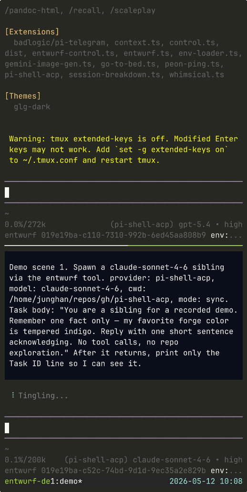

# pi-shell-acp

Use Claude Code, Codex, and Gemini CLI through Agent Client Protocol (ACP) inside pi.

> **Public, active development.** Real working code, still young. Verify it in your own workflow before relying on it all day. Evidence calibration: [VERIFY.md](./VERIFY.md).


```text
pi
  → pi-shell-acp
    → claude-agent-acp | codex-acp | gemini --acp
      → Claude Code | Codex | Gemini CLI
```

`pi-shell-acp` is a thin ACP provider for pi: no OAuth proxy, no CLI transcript scraping, no Claude Code emulation. It connects pi to locally authenticated ACP backends with no core patch and no bypass. Each backend keeps its own model, API, and tool semantics; the bridge shapes only the pi-facing operating surface.

> **Direction.** Inverse of [`pi-acp`](https://github.com/svkozak/pi-acp). `pi-acp` lets external ACP clients talk *to* pi; `pi-shell-acp` lets pi talk *to* ACP backends.

> **Anthropic subscription billing.** From 2026-06-15, Anthropic third-party agent paths (ACP, Agent SDK, `claude -p`, pi-shell-acp's Claude backend) consume a separate Agent SDK credit pool, distinct from Claude chat and the `claude` CLI used as an interactive terminal. `pi-shell-acp` respects that distinction — no bypass, no emulation — and preserves capability dignity across all three backends (see [AGENTS.md](./AGENTS.md) invariants #7, #9, #10). The recommended default runtime leans toward paths outside Anthropic's Agent SDK metering (Codex / Gemini); Claude remains a strong coding worker invoked when its quality is worth the credit cost. The operator decides the mix.

## Concept primer

A few words that look unusual for a coding tool.

- **Entwurf** (기투, projection-of-self) — sibling sessions with their own runtime boundary. Not "delegate," not "worker," not "sub-agent." Spawn, resume, and live peer messaging are first-class.
- **Engraving** — optional short operator text delivered through each backend's native identity carrier. Not a giant hidden prompt, not a tool catalog.
- **MCP** — in this repo, MCP is just the transport by which ACP-backed sessions receive pi capabilities that native pi exposes directly as extensions. It is not a general MCP platform. Explicit `piShellAcpProvider.mcpServers` only; no ambient `~/.mcp.json` scanning, no automatic retrieval. The same `pi-tools-bridge` entry can also be wired into another host's MCP catalog (Claude Code, Codex, Gemini, …) when the operator chooses. `entwurf_self` requires a pi session sender envelope; `entwurf_send` can deliver to live pi sessions from an explicitly wired external MCP host, but only pi-session senders are replyable.
- **Session persistence** — re-attaches pi to the same remote ACP session. Does not hydrate backend transcripts into pi history.

## Install

`pi-shell-acp` is a thin ACP bridge — it connects pi to a local Claude/Codex/Gemini backend the operator has already installed and authenticated. The bridge does not provide Claude credentials, tokens, or subscription access, and does not bypass any backend auth. Whatever the operator's local `claude` / `codex` / `gemini` already trusts is what pi-shell-acp uses.

`pi` accepts four install sources for the bridge — `npm:` or `git:`, each in **global** (default, writes to `~/.pi/agent/settings.json`) or **project** (`-l` flag, writes to `.pi/settings.json`) scope. A fifth path is a local clone for hacking on the bridge.

After installing the package, run `run.sh install .` in your target project. The script writes the `piShellAcpProvider` block into `.pi/settings.json` with the correct absolute path for `pi-tools-bridge/start.sh` — no hand-editing required. The exact location of `run.sh` depends on which install path was used (each section below shows it). For manual configuration, [`pi/settings.reference.json`](./pi/settings.reference.json) is the reference shape — see [Settings](#settings) below.

### From npm — global (Phase 3 target)

```bash
pi install npm:@junghanacs/pi-shell-acp     # not on npm yet — 0.7.0 publish pending
cd /path/to/your-project
"$(npm root -g)/@junghanacs/pi-shell-acp/run.sh" install .
"$(npm root -g)/@junghanacs/pi-shell-acp/run.sh" smoke-all .
```

### From npm — project (`-l` flag, Phase 3 target)

```bash
cd /path/to/your-project
pi install -l npm:@junghanacs/pi-shell-acp
./.pi/npm/node_modules/@junghanacs/pi-shell-acp/run.sh install .
./.pi/npm/node_modules/@junghanacs/pi-shell-acp/run.sh smoke-all .
```

### From source via pi — global (current recommended)

```bash
pi install git:github.com/junghan0611/pi-shell-acp
cd /path/to/your-project
~/.pi/agent/git/github.com/junghan0611/pi-shell-acp/run.sh install .
~/.pi/agent/git/github.com/junghan0611/pi-shell-acp/run.sh smoke-all .
```

### From source via pi — project (`-l` flag)

```bash
cd /path/to/your-project
pi install -l git:github.com/junghan0611/pi-shell-acp
./.pi/git/github.com/junghan0611/pi-shell-acp/run.sh install .
./.pi/git/github.com/junghan0611/pi-shell-acp/run.sh smoke-all .
```

### Local development clone

```bash
git clone https://github.com/junghan0611/pi-shell-acp ~/repos/gh/pi-shell-acp
cd ~/repos/gh/pi-shell-acp
pnpm install
pi install ./
./run.sh install /path/to/your-project
./run.sh smoke-all /path/to/your-project
```

> **First time on a clean Ubuntu / Debian / macOS host?** See the [clean-host walk-through](./docs/setup-clean-host.md) — Stages 0–4b verified end-to-end: `nvm` + `pnpm` + `pi` install, `pi install git:...`, `run.sh install .`, missing-auth boundary surface, and authenticated runtime smoke for Claude / Codex / Gemini.

> The OpenClaw plugin sibling lives at [`plugins/openclaw`](./plugins/openclaw) and ships as its own npm package (`@junghanacs/openclaw-pi-shell-acp`). It is not part of the root `pi-shell-acp` install above — see [Host adapters](#host-adapters).

> **Extension set — do not filter.** `pi-shell-acp` ships four `pi.extensions` entries as a single set: the provider extension (`index.ts`) plus three `pi-extensions/*.ts` modules (entwurf, entwurf-control, model-lock). Filtering some out via pi's object-form package configuration can leave the model lock or entwurf surface in a broken state. Disable the entire package or none of it unless you know precisely which boundary you are turning off.

### Backend prerequisites

Claude / Codex ACP server packages (`@agentclientprotocol/claude-agent-acp`, `@zed-industries/codex-acp`) ship as pinned `dependencies` of `pi-shell-acp`; backend authentication still belongs to the operator's local CLI / runtime. Once the bridge is installed, the resolver picks the ACP server in this order:

1. **`CLAUDE_AGENT_ACP_COMMAND` / `CODEX_ACP_COMMAND` env override** — explicit override for an alternative binary or a wrapper command.
2. **`require.resolve(...)` against the bundled package dependency** — `@agentclientprotocol/claude-agent-acp` for Claude, `@zed-industries/codex-acp` for Codex. This is the default path; no extra global install needed.
3. **`PATH:claude-agent-acp` / `PATH:codex-acp` fallback** — used when the package resolution fails (e.g. a hand-edited `node_modules`).

Codex smoke (no global install required — the codex-acp pinned in `dependencies` is resolved automatically):

```bash
./run.sh smoke-codex /path/to/your-project
```

To force a global `codex-acp` (PATH fallback or development override):

```bash
pnpm add -g @zed-industries/codex-acp@0.14.0
```

Gemini is different — the `gemini` CLI binary is itself the ACP server, not a separate `*-acp` server package. It must be installed and authenticated on the operator's machine. Curated model: `pi-shell-acp/gemini-3.1-pro-preview`.

```bash
pnpm add -g @google/gemini-cli
gemini   # one-time interactive login (oauth-personal) or set GEMINI_API_KEY
./run.sh smoke-gemini /path/to/your-project
```

Backend is inferred from the model — Anthropic → `claude`, OpenAI → `codex`, Gemini → `gemini`. Set `backend` only to pin.

### Host adapters

This repo also carries `plugins/*` — sibling packages that adapt the same bridge to non-pi hosts. Currently:

- [`plugins/openclaw`](./plugins/openclaw) — OpenClaw plugin, prerelease (manual install only; not published to npm or ClawHub yet).

Each adapter has its own `README.md`. They do not change the pi-facing surface above.

### Emacs frontends

Works from terminals and from Emacs frontends that launch [pi-coding-agent](https://github.com/dnouri/pi-coding-agent).


For a dedicated agent socket, pass the socket name:

```elisp
(setq pi-coding-agent-extra-args
      '("--entwurf-control" "--emacs-agent-socket" "pi"))
```

The bridge exports the socket name to ACP children as `PI_EMACS_AGENT_SOCKET`, so skills call Emacs without hardcoding:

```bash
emacsclient -s "${PI_EMACS_AGENT_SOCKET:-server}" --eval '(...)'
```

## Settings

Reference shape lives in [`pi/settings.reference.json`](./pi/settings.reference.json). Minimum:

```json
{
  "compaction": { "enabled": false },
  "piShellAcpProvider": {
    "appendSystemPrompt": false,
    "settingSources": [],
    "strictMcpConfig": true,
    "showToolNotifications": true,
    "tools": ["Read", "Bash", "Edit", "Write"],
    "skillPlugins": [],
    "permissionAllow": ["Read(*)", "Bash(*)", "Edit(*)", "Write(*)", "mcp__*"],
    "mcpServers": {
      "pi-tools-bridge": {
        "command": "/path/to/pi-shell-acp/mcp/pi-tools-bridge/start.sh",
        "args": []
      }
    }
  }
}
```

`mcpServers` is the only ACP MCP injection path. In practice this repo is about the bundled `pi-tools-bridge`, which carries pi capabilities into ACP-backed sessions — not about being a general MCP catalog. Invalid entries throw `McpServerConfigError` — broken tool state surfaces as broken tool state. `./run.sh install` writes the bundled `pi-tools-bridge` entry and prunes the legacy bundled `session-bridge` entry from older installs.

`appendSystemPrompt: false` is intentional. Pi / AGENTS context rides the first-user augment; putting it into the Claude `_meta.systemPrompt` carrier can route OAuth sessions to metered "extra usage" billing.

### Wiring `pi-tools-bridge` into an external MCP host

The same `pi-tools-bridge` entry shape is accepted by other MCP-aware hosts (Claude Code, Codex, Gemini CLI, …). For Claude Code, two equivalent paths — both result in the same loaded server:

**Option A — CLI add:**

```bash
claude mcp add --scope user pi-tools-bridge \
  bash /absolute/path/to/pi-shell-acp/mcp/pi-tools-bridge/start.sh
```

This writes the entry into `~/.claude.json`'s top-level `mcpServers`. `~/.claude.json` also holds OAuth tokens and cache, so it is not safe to share or version-control. Good for one-off setup.

**Option B — separated `~/.mcp.json` (recommended for SSOT / dotfile workflows):**

```json
{
  "mcpServers": {
    "pi-tools-bridge": {
      "type": "stdio",
      "command": "bash",
      "args": [
        "/absolute/path/to/pi-shell-acp/mcp/pi-tools-bridge/start.sh"
      ],
      "env": {
        "PI_TOOLS_BRIDGE_EXTERNAL_AGENT_ID": "external-mcp/claude-code"
      }
    }
  }
}
```

Claude Code reads `~/.mcp.json` in addition to `~/.claude.json`'s top-level `mcpServers`. Keeping the entry in `~/.mcp.json` makes it shareable and version-controllable (e.g. via a dotfiles or `agent-config` repo) without exposing the OAuth-bearing `~/.claude.json`. The `env` block identifies the calling host on the receiver render — omit it and `entwurf_send` shows `external-mcp/unknown-host`.

Prerequisites on the host running the external MCP client:

- `pi` on PATH (for `entwurf` / `entwurf_resume` spawn paths).
- `~/.pi/agent/entwurf-targets.json` (target registry) when calling `entwurf`.
- A live pi session launched with `--entwurf-control` populates `~/.pi/entwurf-control/<sessionId>.sock`; required for `entwurf_send` and `entwurf_peers`.

From an external MCP host:

- `entwurf`, `entwurf_resume`, `entwurf_peers` work directly.
- `entwurf_send` delivers with `origin: "external-mcp"` / `replyable: false`; `wants_reply: true` is rejected.
- `entwurf_self` refuses to return — it requires a pi session sender envelope (`PI_SESSION_ID` + `PI_AGENT_ID`).

For external MCP hosts with a primary instruction file (`CLAUDE.md` for Claude Code, `AGENTS.md` for Codex, `GEMINI.md` for Gemini CLI), propagating the Asymmetric Mitsein workflow rules into that file lets the host auto-apply them without per-call clarification — which entwurf tools are valid from outside a pi session, the default `mode` / `wants_reply`, and the natural-language-to-tool-call mapping. On Claude Code, the `mcp__*` permission wildcard (or per-tool entries) in `permissions.allow` removes the first-call trust prompt friction.

See the MCP entry in [Concept primer](#concept-primer) and the sender envelope contract in [AGENTS.md](./AGENTS.md).

## Per-backend operating surface

Each backend keeps its native model / API / tools; pi-shell-acp shapes only what enters from pi. All three backends honor explicit `CLAUDE_CONFIG_DIR`, `CODEX_HOME`, `CODEX_SQLITE_HOME`, `GEMINI_CLI_HOME`, and `GEMINI_SYSTEM_MD` exports when set by the operator.

**Claude** uses `_meta.systemPrompt` for engraving and `CLAUDE_CONFIG_DIR` for a whitelist overlay so auth/runtime entries stay available while operator memory, hooks, agents, history, local settings, and project memory remain hidden. The overlay writes an explicit empty `hooks: {}` because Claude SDK organic compaction needs the configured-empty shape; no operator hook definitions are inherited. The four-tool baseline (`Read`, `Bash`, `Edit`, `Write`) is enforced through `tools` + `permissionAllow`; `Skill` is added automatically when `skillPlugins` is non-empty. Operator context cap override: `PI_SHELL_ACP_CLAUDE_CONTEXT=<int>`.

**Codex** has no `_meta.systemPrompt`, so engraving rides codex-rs `-c developer_instructions="<...>"`. Defaults: `approval_policy=never`, `sandbox_mode=danger-full-access`, `web_search=disabled`. `codexDisabledFeatures` (default: `image_generation`, `tool_suggest`, `tool_search`, `multi_agent`, `apps`, `memories`) fails closed on surfaces that would bypass pi's MCP/tool model; `codexDisabledFeatures: []` opts out and emits a warning. `PI_SHELL_ACP_CODEX_MODE=auto|read-only` narrows the default mode. `CODEX_HOME` + `CODEX_SQLITE_HOME` point at a pi-owned overlay that keeps auth/runtime entries and codex state DBs but hides operator history, rules, top-level `AGENTS.md`, personal config, sessions, logs, and memories. codex-rs registers some native tools (`update_plan`, `request_user_input`, `view_image`, MCP resource readers) without config gates; pi-shell-acp documents this mismatch — closing it requires codex-rs changes.

**Gemini** exposes neither `_meta.systemPrompt` nor `developer_instructions` but honors `GEMINI_SYSTEM_MD=<path>` as a full native-system-body replacement; pi-shell-acp authors that overlay file. `GEMINI_CLI_HOME` redirects the binary's `homedir()` to a pi-owned overlay. The tool surface uses defense in depth at two layers — `tools.core` 8-name allowlist (`read_file`, `list_directory`, `glob`, `grep_search`, `write_file`, `replace`, `run_shell_command`, `activate_skill`) plus a deny-all `--admin-policy` with the same class allow. `GEMINI.md` discovery and cwd dir-tree auto-attach are suppressed; the overlay rebuilds every spawn and sweeps `<configDir>/{tmp,history,projects}/`. Operator context cap override: `PI_SHELL_ACP_GEMINI_CONTEXT=<int>`.

Pi is the canonical memory authority (semantic-memory + Denote llmlog); Claude, Codex, and Gemini native memory layers are pinned off, and engraving `${...}` literals are byte-split with U+200B before Gemini `system.md` write so they are visually stable but non-interpolatable.

## Smoke commands

```bash
./run.sh smoke-all .        # triple-backend gate (Gemini auto-skips when not on PATH)
./run.sh smoke-claude .
./run.sh smoke-codex .
./run.sh smoke-gemini .
./run.sh verify-resume .    # cross-process continuity with acpSessionId diagnostics
```

## Custom skills

Claude sessions accept custom skills through `skillPlugins` — an array of absolute paths to directories matching the Claude Agent SDK plugin layout:

```
<your-plugin-root>/
├── .claude-plugin/
│   └── plugin.json
└── skills/
    └── <skill-name>/
        └── SKILL.md
```

A self-contained example lives at [`pi/skill-plugin-example/`](./pi/skill-plugin-example/). Put plugin roots anywhere on disk except under `~/.pi/agent/` (pi's internal cache).

```json
{
  "piShellAcpProvider": {
    "skillPlugins": ["/absolute/path/to/your-plugin-root"]
  }
}
```

`Skill` is auto-added to `tools` and `Skill(*)` to `permissionAllow` whenever `skillPlugins` is non-empty. Each entry is validated at settings parse time and throws when the path is missing, not absolute, not a directory, or missing `.claude-plugin/plugin.json`. The Claude session does not start until the violation is fixed. The bridge does not validate `plugin.json` contents or `SKILL.md` bodies — that is the Claude Agent SDK's contract.

To verify, start a fresh Claude session and ask the model to list its skills; the names declared in your `SKILL.md` frontmatter should appear among the visible skills. The operator-driven version of this check is `Q-SKILL-CALLABLE` in [VERIFY.md](./VERIFY.md).

`skillPlugins` is a Claude-backend-only install surface. Codex and Gemini expose skills through native `~/.codex/skills/` and `~/.gemini/skills/` passthrough; Gemini additionally activates them through the `activate_skill` tool.

For a real consumer arranging many skills, see [agent-config](https://github.com/junghan0611/agent-config).

## Entwurf orchestration

**Entwurf is a pi capability with two surfaces.** Native pi exposes it directly as an extension tool; ACP-backed sessions reach the same capability through pi-shell-acp's MCP/Unix-socket bridge. The purpose is not to invent a different sub-agent system, but to preserve the same sibling-based model across backends.

Spawning creates a sibling, not a worker, delegate, or sub-agent — the spawned session has its own runtime boundary and its own provider/model identity. Resume preserves model identity (no override). Default mode is `sync`; `async` is opt-in.

A two-pane recording covers the surface end-to-end — sibling spawn, cross-process MCP resume across a different cwd, and a live peer greeting through `entwurf_send`:

<details>
<summary>Watch (518×1030 GIF, click to expand)</summary>



</details>

Live peer messaging (`entwurf_send`, `/entwurf-send`, in-process tool) carries a sender envelope `{ sessionId, agentId, cwd, timestamp }` by default; `entwurf_self` returns the same envelope for the current session. External MCP hosts can call `entwurf_send` with a marked non-replyable envelope, while `entwurf_self` remains pi-session-only. `wants_reply` is an etiquette marker rendered as a `(wants reply)` badge — not a transport contract, no wait, no polling — and is rejected from non-replyable external senders.

In ACP-backed sessions, agent tools (`entwurf`, `entwurf_resume`, `entwurf_send`, `entwurf_peers`, `entwurf_self`) auto-attach through `pi-tools-bridge`; in native pi sessions, the same capability is available directly through the extension surface. Operator slash commands (`/entwurf`, `/entwurf-status`, `/entwurf-sessions`, `/entwurf-send`) require `--entwurf-control`. The spawn target allowlist is [`pi/entwurf-targets.json`](./pi/entwurf-targets.json).

The human-greeted 담당자 pattern is first-class: the operator opens a pi-shell-acp session in repo B, greets it directly, then passes that `sessionId` to another session via `entwurf_send`. Spawned siblings and human-opened peers share the same messaging semantics; only the creation sequence differs.

**Asymmetric Mitsein** (비대칭 공존) — the cross-harness counterpart. Pi may collaborate with an external interactive coding session (Claude Code, Codex, Gemini CLI used as a human terminal) without spawning it. The two channels are deliberately asymmetric: outbound `pi → external` rides whatever the operator already uses (tmux send-keys, manual paste, any interactive input path), while inbound `external → pi` returns through this bridge's `entwurf_send`. The pi-side sessionId travels inside the task instruction itself, so no second harness, no control daemon, and no transcript scraping are introduced. This is a workflow pattern, not a product surface — the bridge stays thin; the asymmetry is an honest acknowledgment of the limit, not a defect.

After a session is anchored, pi-shell-acp locks its model identity: switches that touch `pi-shell-acp` are reverted; native-to-native and pre-turn selection remain free. `ensureBridgeSession` refuses direct reuse-path mismatches before backend handoff.

Reproduce + debug: [`demo/README.md`](./demo/README.md).

## Context carriers

System / developer carriers and rich pi context are separate.

The carrier holds an optional short operator engraving from [`prompts/engraving.md`](./prompts/engraving.md); empty or missing is fine. Template variables: `{{backend}}`, `{{mcp_servers}}`. A/B with `PI_SHELL_ACP_ENGRAVING_PATH=/path/to/alt.md`. Do not put AGENTS.md, bridge narrative, or tool catalogs here — large Claude carriers can route OAuth sessions to metered "extra usage" billing.

Bridge identity, pi context, `~/AGENTS.md`, `cwd/AGENTS.md`, and date/cwd ride a one-shot first-user prepend (`pi-context-augment.ts`). Entwurf prompts already carry `cwd/AGENTS.md` inside `<project-context ...>`; the augment removes that duplicate. The augment describes capabilities, but the **actual callable schema remains source of truth** — `read` vs `Read` vs `exec_command`, MCP only when schema-visible.

## Compaction policy

**pi-shell-acp does not implement compaction.** When a backend compacts natively, the pi session and mapping survive that.

Pi-side JSONL compaction is blocked by default — `session_before_compact` returns `{cancel: true}` because pi-side summary does not reduce the backend transcript. Opt back in only with `PI_SHELL_ACP_ALLOW_PI_COMPACTION=1`.

Backend-native compaction is always allowed. The bridge does not surface backend-specific compaction knobs; operators who need to alter a backend's auto-compaction configure that backend through its own native interface.

The legacy single knob `PI_SHELL_ACP_ALLOW_COMPACTION` is rejected at spawn intent with a next-action message pointing at `PI_SHELL_ACP_ALLOW_PI_COMPACTION`.

The footer uses ACP `usage_update.used / size` (backend prompt/tools/cache/session included) with `[pi-shell-acp:usage] ...` diagnostics. Near limit, choose a visible action: clear, open a new session with a different model, or let the backend compact on its own.

Identity-isolation env (`CLAUDE_CONFIG_DIR`, `CODEX_HOME`, `CODEX_SQLITE_HOME`, `GEMINI_CLI_HOME`, `GEMINI_SYSTEM_MD`) is unrelated to compaction and ships unconditionally.

Verification: `./run.sh smoke-compaction-policy` (deterministic). `LIVE=1 ./run.sh smoke-compaction-policy` adds backend-owned continuation probes: Claude and Codex carry release evidence for explicit / organic backend compaction, while Gemini is recorded as an honest ACP asymmetry because its native CLI `/compress` is not exposed as an ACP command. Probe outcomes live in [demo/compaction-policy-smoke/README.md](./demo/compaction-policy-smoke/README.md), with the release baseline and verification framing in [BASELINE.md](./BASELINE.md) and [VERIFY.md](./VERIFY.md); the probe is not a product surface (no user-facing `/acp-compact`).

## What this repo owns, and does not

Owns: provider registration (`pi-shell-acp/...`), ACP subprocess lifecycle + `resume > load > new`, prompt forwarding + ACP event mapping, the bridge surface that exposes pi capabilities such as entwurf to ACP-backed sessions, pi-facing MCP injection via `piShellAcpProvider.mcpServers`, and bridge-local cleanup and diagnostics.

Does not: reconstruct full history, hydrate backend transcripts into pi history, emulate Claude Code or Codex, run broad multi-agent orchestration (entwurf is narrow, registry-gated, identity-locked), or run a second session model competing with pi.

Only `pi:<sessionId>` mappings are persisted (`~/.pi/agent/cache/pi-shell-acp/sessions/`) — enough to re-attach pi to the same remote ACP session, never enough to act as a second harness. Backend stores (`~/.claude/`, `~/.codex/`, `~/.gemini/`) are interoperability side effects, not authority.

This repo also doubles as the maintainer's working laboratory for agent-harness boundaries — new workflow patterns (e.g. Asymmetric Mitsein) land here first as low-level instruments, before crystallizing into invariants or graduating into more polished surfaces elsewhere.

## Verification surfaces

- **[VERIFY.md](./VERIFY.md)** — agent-driven. One ACP-bridged identity runs the script against another and records what it sees. Carries the Evidence Levels L0–L5 rung ladder and the Claims Ledger so each claim is parked at the rung it has actually reached.
- **[BASELINE.md](./BASELINE.md)** — operator-driven. The maintainer runs the interview directly (no agent in the verifier seat) and the result is recorded.

Use both. Either one alone leaves a blind spot the other closes.

## References

- File map + code-level invariants: [AGENTS.md](./AGENTS.md)
- Current priority + open decisions: [NEXT.md](./NEXT.md)
- Release record: [CHANGELOG.md](./CHANGELOG.md)
- [xenodium/agent-shell](https://github.com/xenodium/agent-shell) — Emacs ACP client, `resume > load > new` idea origin
- [agentclientprotocol/claude-agent-acp](https://github.com/agentclientprotocol/claude-agent-acp) — canonical ACP server for Claude Code
- [agent-config](https://github.com/junghan0611/agent-config) — real consumer repo

## License

MIT
