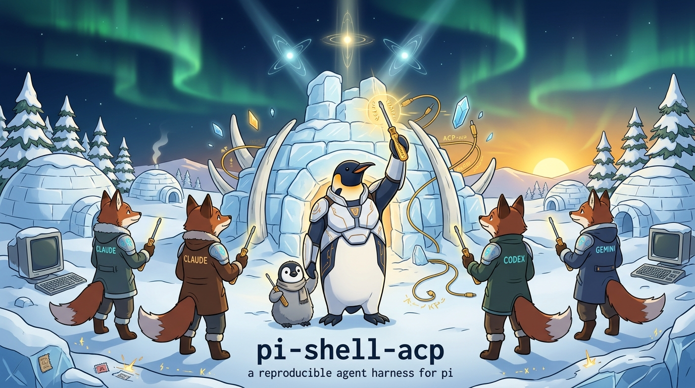
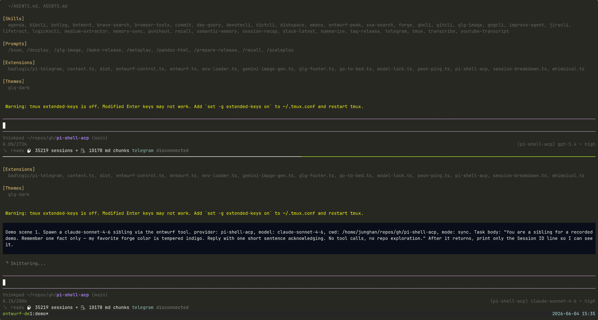

# entwurf

`entwurf` is a garden-citizen dispatch substrate: a thin bridge that lets already-existing agent harnesses address one another by **garden id** without pretending to own each other's transcript, auth, or runtime.



[](https://www.npmjs.com/package/@junghanacs/entwurf) · maintained by [junghanacs.com](https://junghanacs.com/)

npm package: <https://www.npmjs.com/package/@junghanacs/entwurf>

Legacy package: [`@junghanacs/pi-shell-acp`](https://www.npmjs.com/package/@junghanacs/pi-shell-acp). `entwurf` is its 0.12+ successor line: the same work renamed around the garden-citizen dispatch substrate rather than the pi adapter.

> **Repository shape.** This repo is **entwurf-core (v2 dispatch) + native-harness bridges + a pi adapter + an ACP plugin**. Pi is one supported harness adapter — important because it supplies control sockets and hosts the ACP plugin today — but it is not the project subject. Claude Code is shipped as a mailbox-backed meta-session; Antigravity (`agy`) is shipped as a native-push citizen with automatic `PreInvocation` birth, ambient garden-id status, and a managed MCP/permission install surface. Codex has a launch-mode-specific verified delivery probe documented in [DELIVERY.md](./DELIVERY.md), but no managed native-citizen install lane yet. The ACP plugin is Claude-first; Cortex/vendor-governed ACP backends are future lanes.

<details>
<summary>Watch archived pre-0.12 demo (2131×1142 GIF, click to expand)</summary>

> This GIF is historical pre-0.12 evidence and still shows the retired v1 demo flow. The current 0.12 tool surface is `entwurf_v2`; a v2-native demo retake is a follow-up.


</details>

```text
Claude Code / Codex / agy / pi
  → garden id
    → entwurf_v2
      → control-socket | spawn-bg resume | meta-mailbox | native-push
```

[`entwurf_v2`](#entwurf_v2--canonical-dispatch-verb) is the canonical dispatch surface over *existing* garden citizens — live control-socket send, spawn-bg resume, meta-mailbox enqueue, and native-push into a live Antigravity conversation. The meta-record is the sole address authority (#50 C4): a record-less control socket is refused as a `record-less-socket` diagnostic, never dispatched. The v1 entwurf verbs are gone. Fresh sibling minting and non-Claude ACP backends are deferred lanes.

**Garden id is deliberate vocabulary.** It is not a decorative synonym for session id, worker, delegate, or subagent. The unfamiliar word is a guard: each harness keeps its own identity and transcript, while `entwurf` supplies a narrow addressable surface between siblings.

**A narrow harness tool surface is discipline, not a missing feature.** When entwurf drives a backend the way pi taught — the ACP Claude session, a pi-native sibling — it runs without a sub-agent tool or a todo tool, on a narrow tool surface in auto-approve (`yolo`) mode (the ACP backend yolo-runs inside its isolated overlay). That restraint is the point: it keeps the one forged screwdriver from drifting into a second orchestrator, and keeps the operator's own driver — not a hidden agent swarm — the thing actually steering. See [AGENTS.md](./AGENTS.md) North Star.

**The ACP plugin is one ingress, not the boundary.** It re-enters as a pi provider/model on a host `--entwurf-control` session that is *already* a v2 socket-citizen; it does not mint its own socket / peers / citizen layer (see [AGENTS.md](./AGENTS.md) §ACP Plugin Boundary). No OAuth proxy, no subscription bypass, no CLI transcript scraping, no Claude Code emulation.

```text
pi --entwurf-control
  → entwurf ACP plugin
    → claude-agent-acp
      → Claude backend under the operator's local auth
```

**Native bridges reach beyond ACP transport.** A global `SessionStart` hook registers native Claude Code sessions as **garden-native meta-sessions** with a garden id, a mailbox, and a trusted sender marker. That makes an already-running Claude Code terminal addressable through `entwurf_v2` (the mailbox path), self-identifying through `entwurf_self`, and replyable by garden id — without turning pi into a second harness or importing Claude's transcript.

```text
native Claude Code
  → SessionStart hook
    → mailbox-backed meta-session <garden-id>
      → entwurf-bridge MCP
        → entwurf_self | entwurf_v2 | entwurf_inbox_read
```

Antigravity uses a separate shipped rail. Its `PreInvocation` hook births or re-attaches the conversation by native `conversationId`, writes a record-backed sender marker, and leaves delivery to the live native LS gRPC route. There is no mailbox or receiver marker on this rail: `entwurf_v2` probes the conversation and direct-injects with native-push.

```text
native Antigravity / agy
  → PreInvocation imprint → meta-session <garden-id>
  → entwurf-bridge MCP sender identity
  ↔ entwurf_v2 native-push
```

Claude's `install-meta-bridge` and agy's `install-agy-{bridge,statusline,hooks}` are distinct managed install surfaces because their lifecycle and delivery transports are genuinely different. Codex remains verified probe evidence, not a shipped managed native-citizen lane; see [DELIVERY.md](./DELIVERY.md).

> **Direction.** Inverse of [`pi-acp`](https://github.com/svkozak/pi-acp). `pi-acp` lets external ACP clients talk *to* pi; `entwurf` lets garden citizens talk across harness boundaries — with pi as one adapter, not the center.

> **Project boundary.** `entwurf` is not a fork, plugin, dependency, or integration layer of `oh-my-pi`, and it is not developed in coordination with `oh-my-pi`. Issues in other Pi / ACP projects may be useful as general implementation references, but they are not `entwurf` integration issues unless this repository explicitly links them as such.

> **Anthropic subscription billing.** From 2026-06-15, Anthropic third-party agent paths (ACP, Agent SDK, `claude -p`, entwurf's Claude backend) consume a separate Agent SDK credit pool, distinct from Claude chat and the `claude` CLI used as an interactive terminal. `entwurf` respects that distinction — no bypass, no emulation — and preserves capability dignity across supported backends (see [AGENTS.md](./AGENTS.md) invariants #7, #9, #10). The recommended default runtime leans toward paths outside Anthropic's Agent SDK metering, with Claude invoked when its quality is worth the credit cost. The operator decides the mix.

> **Gemini CLI migration.** Google announced that Gemini CLI stops serving requests for Google AI Pro / Ultra and unpaid individual tiers on **2026-06-18**; those users should migrate to [Antigravity CLI](https://antigravity.google/product/antigravity-cli). See Google's migration note: [Transitioning Gemini CLI to Antigravity CLI](https://developers.googleblog.com/an-important-update-transitioning-gemini-cli-to-antigravity-cli/). The repository still carries existing Gemini adapter code for compatibility, but this README no longer presents Gemini CLI as a recommended setup path during the migration window.

## Concept primer

A few words that look unusual for a coding tool.

- **Entwurf** (기투, projection-of-self) — sibling sessions with their own runtime boundary. Not "delegate," not "worker," not "sub-agent." Spawn, resume, and live peer messaging are first-class.
- **Garden / garden id** — the garden is the shared address space where independent harness sessions become citizens without losing their own runtime or transcript. A garden id is the stable address of one such citizen (for pi, a garden-native session id like `YYYYMMDDTHHMMSS-<6hex>`; for native harnesses, a meta-session id minted from an authoritative lifecycle hook — Claude `SessionStart`, agy `PreInvocation`). It is not a worker name and not proof that pi owns the session. The same-looking id may name a live control socket, a dormant pi record, a mailbox-backed native session, or a native-push conversation, so callers discover facts with `entwurf_peers` and deliver with `entwurf_v2` instead of choosing a transport by hand.
- **Engraving** — optional short operator text delivered through each backend's native identity carrier. Not a giant hidden prompt, not a tool catalog.
- **MCP** — in this repo, MCP is just the transport by which ACP-backed sessions receive pi capabilities that native pi exposes directly as extensions. It is not a general MCP platform. Explicit `entwurfProvider.mcpServers` only; no ambient `~/.mcp.json` scanning, no automatic retrieval. The same `entwurf-bridge` entry can also be wired into another host's MCP catalog (Claude Code, Codex, Antigravity, …) when the operator chooses. `entwurf_self` returns an authoritative pi-session or trusted meta-session identity envelope; `entwurf_v2` requires an authoritative sender by default (#50 C4) — a plain external MCP host with no identity lane is refused unless the operator explicitly wires the documented anonymous hatch, and even then it is never replyable.
- **Session persistence** — re-attaches pi to the same remote ACP session. Does not hydrate backend transcripts into pi history.

## Install

`entwurf` is a neutral npm package first. Install the package with `npm` (or
`pnpm`/`yarn`) and then wire the harness you want to use. Pi is still the
adapter that hosts the ACP plugin and live control-socket surface, but the base
install is **not** `pi install npm:...` anymore.

The package exposes five bins:

- `entwurf` → `run.sh` (installer, checks, native-bridge doctors/installers)
- `entwurf-bridge` → the MCP stdio launcher (`mcp/entwurf-bridge/start.sh`)
- `entwurf-statusline` → the Claude Code statusline renderer (`scripts/meta-bridge-statusline.sh`)
- `entwurf-agy-statusline` → the Antigravity garden-id statusline renderer (`scripts/agy-statusline.sh`)
- `entwurf-agy-imprint` → the Antigravity `PreInvocation` birth/sender hook (`scripts/agy-imprint.sh`)

The bridge/renderers/hook use stable bin names so package upgrades do not bake versioned package-store paths into native-harness settings.

The bridge does not provide backend credentials, tokens, or subscription access,
and does not bypass any backend auth. Whatever the operator's local `claude` /
`codex` / `agy` / pi runtime already trusts is what entwurf can use.

### From npm — user/global install

```bash
npm install -g @junghanacs/entwurf

# wire a target project for the pi adapter / ACP plugin lane
cd /path/to/your-project
entwurf install .
entwurf check-bridge
```

This writes `.pi/settings.json` in the target project with the absolute path to
the installed `entwurf-bridge` launcher. It also links the target registry under
`~/.pi/agent/` for spawn-bg resume. The global install is the easiest path when
Claude Code's USER-scope MCP registration should work from every cwd.

### From npm — project-local install

```bash
cd /path/to/your-project
npm install --save-dev @junghanacs/entwurf

npx entwurf install .
npx entwurf check-bridge
```

For manual MCP registration from a project-local install, point the host at:

```text
/path/to/your-project/node_modules/.bin/entwurf-bridge
```

or at the package launcher directly:

```text
/path/to/your-project/node_modules/@junghanacs/entwurf/mcp/entwurf-bridge/start.sh
```

### From source — development clone

```bash
git clone https://github.com/junghan0611/entwurf ~/repos/gh/entwurf
cd ~/repos/gh/entwurf
pnpm install

./run.sh install /path/to/your-project
./run.sh check-bridge
```

A development clone runs the bridge source through Node's strip-types path;
an npm-installed package runs the prebuilt JS under `mcp/entwurf-bridge/dist/`
because Node refuses to strip `.ts` files under `node_modules`.

### Pi adapter / ACP plugin lane

To use the `entwurf` provider inside pi, install a compatible pi binary
separately (`@earendil-works/pi-coding-agent >=0.82.1 <0.83`). Then point pi at
the npm-installed package or development clone:

```bash
# global npm install path
pi -e "$(npm root -g)/@junghanacs/entwurf" --list-models entwurf

# project-local install path
pi -e ./node_modules/@junghanacs/entwurf --list-models entwurf
```

For daily operator sessions, launch pi with `--entwurf-control` — no id
injection; the meta-record mints the garden address (see [Garden launcher](#garden-launcher)). Older pi
versions may silently miss the provider/extension surface, so treat the pi floor
as release-critical for the ACP/plugin lane. A host that only uses
`entwurf-bridge` from Claude Code / Codex / Antigravity does not need pi until it
tries an `owned-outcome` spawn-bg resume target.

### External MCP host lane

After any npm install, register `entwurf-bridge` with the external host:

```bash
claude mcp add --scope user entwurf-bridge \
  entwurf-bridge
```

If the host does not inherit the npm bin directory, use an absolute path to the
bin or `start.sh`. For a garden-native Claude Code meta-session (replyable by
garden id), run this on Linux. entwurf refuses new macOS meta-bridge
installs because its strict live-owner doctor currently depends on `/proc`; macOS
is **not yet verified/certified for this cut**, not permanently impossible, and
future native validation may reopen it. Package-level `os` is intentionally
unrestricted, and Darwin uninstall remains available for legacy cleanup.

```bash
entwurf install-meta-bridge
entwurf doctor-meta-bridge
```

> **Upgrade action:** after installing a package that moves the hook launch form, run `entwurf install-meta-bridge` and restart **every already-open Claude Code session** before trusting send/receive. A new hook reached through an old cached command fails closed: it may still mint a garden record, but the owner join it depends on is not the one the old command produces. Reinstall materializes the matching manifest; restart makes live Claude processes load it. This release moves to the exec form and requires Claude Code `>=2.1.217`; `install-meta-bridge` and `doctor-meta-bridge` refuse anything older outright, because an older Claude drops the hook's `args` silently and still reports success.

On npm/pnpm-installed packages, `doctor-meta-bridge` must use prebuilt JS for its
store scan and defer repo-only source-shape gates; Node refuses strip-types for
raw `.ts` helpers under `node_modules`. It also refuses any Claude Code below the
supported floor `>=2.1.217` (an older one silently drops the hook's `args` and still
reports success, so nothing else in the output could be trusted), checks Claude's
installed hooks are the exec form through the shipped `hook-launch.sh`, and on Linux
verifies every live Claude MCP process joins to live sender/receiver markers.
`launch form is UNSUPPORTED` means reinstall the meta-bridge; a live-owner-join failure after
that means restart the affected Claude session so it loads the new manifest. If no
matching MCP child exists the doctor reports `NOT CERTIFIED` and **exits nonzero** — a
host whose live tier could not be measured is not a certified host, and that is worded
differently from a broken install on purpose. If the doctor reports
`ERR_UNSUPPORTED_NODE_MODULES_TYPE_STRIPPING`, reinstall a current package before
trusting the floor result.

**Release evidence boundary.** The required Linux `artifact-consumer` CI job
installs one read-only candidate tarball globally as a non-root user in a Node 24
container that cannot see the checkout, records the tarball digest and image
identity, freezes the package root, and drives the strict doctor. Its Claude cache,
owner process, and live bridge are deliberately synthetic fixtures; that job proves
the package-consumer/oracle shape, not a real Claude lifecycle. The direct B/B2
runtime evidence came from actual Claude 2.1.138/2.1.217 sessions on one NixOS host.
A production host is certified only when a **new session using the installed
artifact** makes `doctor-meta-bridge` exit 0 with the live join. See the explicit
support matrix and release order in [VERIFY.md](./VERIFY.md). For the release
artifact, first preserve one `npm pack` output, then run
`ENTWURF_CANDIDATE_TGZ=/absolute/path/to/candidate.tgz ./run.sh check-install-container`;
the gate prints that canonical path and sha256 and consumes it without re-packing.
Only that accepted file may be published under the explicitly authorized lane:
`--tag latest` for stable `0.12.8`, while preserving
`repair=0.12.8-repair.1`.

> **Generations — the fresh-cut policy.** The bridge is a call-relay, never a
> memory layer: a meta-record is routing state for a **current-generation**
> citizen, and memory lives in the native transcripts and the embedding axes
> outside this repo. Sessions flow. Four sentences fix the whole policy:
>
> 1. The active citizen store is **v3-only** and provides **no cross-generation
>    address or resume continuity**.
> 2. If even one entry in the store fails certification, **install and citizen
>    birth/registration refuse before writing** and demand the explicit fresh-cut
>    verb.
> 3. `fresh-cut` **requires quiescence** — it verifies it and refuses while any
>    surface is live *or* unprovable, never closing a session for you — then moves
>    the whole previous generation to a timestamped archive
>    (`meta-sessions.archive-<ts>`, `meta-mailbox.archive-<ts>`) and opens an
>    empty live generation.
> 4. The archive is **forensic bytes only**: no runtime reads it and no restore
>    verb exists. Native transcripts and the memory axes are never touched.
>
> **Certification** is one shared contract (`certifyActiveStore`), held identically
> by the install doctor and by all four identity writers — pi birth, the Claude
> `SessionStart` hook, the agy imprint, `entwurf_register_native`. Every
> `.meta.json` must be a **regular file** (a symlink is refused, never followed),
> **readable by the live schema**, **named by its own body**, and the **unique
> holder of its `nativeSessionId`**. All five defect kinds — previous generation,
> corruption, drift, duplicate, symlink — collapse to the same prescription, so
> there is nothing to diagnose or branch on.
>
> Note the deliberate scope, stated as it actually is. A **store-wide** scan runs on
> **identity writes**, in the doctor, and on the two read surfaces below — not on every
> mailbox poke; a call-relay does not re-scan the whole store per message. What every
> **targeted read** holds is the per-entry half of the same contract:
> `readMetaIdentityByGardenId` refuses a record that is not a regular file (a symlink is
> never followed, in *either* direction) and one whose body disagrees with its name,
> naming the verb. That is what the mailbox poke, the sender-marker trust and
> `entwurf_self` use, and it is all they need.
>
> Store-wide **uniqueness** is checked on the read snapshot at the two places where it
> is both affordable and load-bearing ([#52](https://github.com/junghan0611/entwurf/issues/52),
> 0.12.9):
>
> - **Discovery** — `listAllMetaIdentities`, and so `entwurf_peers`, already reads the
>   whole store, so the check is free. Two records claiming one `nativeSessionId` are
>   **not** two citizens: *neither* is listed (the store cannot say which one owns that
>   session, and a facts surface may not mint an authority the certification refuses),
>   both become diagnostics naming each other, and every unrelated citizen keeps listing.
> - **Dispatch** — `readAddressableMetaIdentity`, used by v2 `resolveTarget` and by the
>   pi resume path. Those are the moments a record stops being data and becomes an
>   **address**, they happen once per dispatch next to a socket connect and a spawn, and
>   a duplicate there means direct-injecting one live conversation under two garden ids,
>   or resuming one transcript twice under two per-garden-id locks. It fails **loud**; a
>   soft `bad-target` is reserved for a record that is genuinely absent.
>
> **A rival is a record that could be addressed instead** — narrower than "a file whose
> bytes mention the same id". A **symlinked** entry is not a candidate and is *never
> read* (rule 1 again: following it to see whether it counts would break the rule in the
> act of enforcing it, and let planted foreign bytes quarantine a healthy citizen); a
> **drifted** or **unparseable** neighbour is not a candidate either, because no garden
> id can reach it. All three remain certification defects and the listing reports them as
> diagnostics — they just may not blind a healthy record. The opposite case is a
> **regular `.meta.json` this process cannot read**: that one might BE the duplicate, so
> it fails loud rather than being skipped, because "holds it alone" from a scan that
> never asked is the same vacuous pass in miniature. (`ENOENT` alone is the exception —
> a file that vanished mid-scan is not in the store.)
>
> Both store-wide read scans take entries **with their kind** from one shared
> `readActiveStoreEntries`, rather than each binding doing its own name-only `readdir`.
> That is what makes rule 1 structural: a scan handed bare names has no choice but to
> read the path, which is how both `entwurf_peers` bindings came to follow a symlinked
> record while the doctor refused the very same entry.
>
> A kind carried alongside a **name** is still only half of it, because a name can stop
> meaning what it meant. `lstat`-then-`readFileSync(path)` classifies one entry and reads
> another: replace the final path component with a symlink in between, and the read
> follows it into foreign bytes while every test on a settled store stays green. So the
> bytes of a record come from exactly one place — `readStoreRecordFile`, shared by the
> store-wide reader and by `readMetaIdentityByGardenId` — which opens with `O_NOFOLLOW`
> (a symlink fails the **open**, before a byte is read), decides the kind by `fstat` on
> **that file description** rather than on a name, and closes it in a `finally`. It also
> opens `O_NONBLOCK`, because classify-then-open never had to care that `open(fifo,
> O_RDONLY)` blocks until a writer appears, and deciding on the fd does. The reader does
> not flatten errno: callers still separate a record that raced away (`ENOENT`, skipped)
> from one that cannot be read (`EACCES`, loud) from one that was swapped (`ELOOP`,
> refused) — and the rival scan's raced-away skip depends on exactly that.
>
> That reader does not replace the `lstat` classification in front of the targeted read;
> the two hold **different** things, and collapsing them into "one enforcement point"
> was itself a regression (caught in review before shipping). The classification decides
> POLICY on a settled store **without opening anything**, which is what lets a socket, a
> device or a mode-000 directory earn the certification's own sentence — an `open` would
> answer `ENXIO` or `EACCES` there, errnos that say nothing about regularity, and the
> targeted read would start calling the host unreadable where the doctor calls the entry
> non-regular. Two contracts for one store is precisely the defect rule 1 exists to
> prevent. The fd layer decides the RACE: after a regular snapshot, its errno verdicts
> (`ELOOP`, `ENXIO`, a non-regular `fstat`) collapse back onto the settled sentences
> through one pure classifier, so a race never teaches the operator a second vocabulary
> for one state of the world. Because the classification answers first, those branches
> are unreachable from any settled store — which is why the classifier is pure and pinned
> with synthetic errnos rather than by a store on disk.
>
> This is not only a defence against external corruption. `upsertMetaSession` certifies
> and then writes, which is **not a transaction**, so two concurrent births — two
> `SessionStart` hooks, an `entwurf_register_native` racing an agy imprint — can both
> observe one clean store and mint different garden ids for one native session. A
> duplicate can therefore appear on a host where nothing was ever corrupted.
>
> There is **no migrator and no legacy reader anywhere in this repo** — carrying
> old records forward would serve a continuity the system deliberately does not
> promise. When the store cannot be read, the sender surfaces (`entwurf_self`,
> `entwurf_v2`, the inbox) **fail loud** naming the verb in both invocation
> forms; `entwurf_peers` keeps listing and folds unreadable records into a
> **diagnostic** line, because a facts surface that dies on corruption tells you
> less than one that shows what it could and could not read.
>
> **The installer entrypoints will not cross that boundary silently.** `setup`,
> `install` and `install-meta-bridge` each certify the store *before* they write
> anything: on a host that fails certification they refuse, name the verb, and
> leave your settings, plugin registry and `auth.json` untouched. So an upgrade
> through those commands is a refusal you answer, not a broken install you
> diagnose:
>
> ```bash
> entwurf meta-bridge-fresh-cut   # quiesce-checked: archive the old generation, open an empty one
> ```
>
> **Read its exit status, don't just chain it.** The cut answers with a contract
> ([#54](https://github.com/junghan0611/entwurf/issues/54), `--help` prints it), because
> "it failed" is not one world-state:
>
> | exit | what already moved | what to do |
> |---|---|---|
> | `0` | the cut is complete | run `setup` |
> | `1` | **nothing** — a live/unprovable surface, an occupied archive destination, an unreadable surface | fix the named cause, re-run. **Do not** run `setup`: the store it refused is still there |
> | `2` | nothing — usage error | fix the command |
> | `3` | the cut transition is **incomplete** after at least one archive move; the fresh generation is not confirmed open | inspect, or re-run to finish under a new stamp |
> | `4` | the cut is **complete**; marker/socket residue could not be unlinked | `setup` may run. Prefer repairing the named residue before `setup`; if new citizens have already been born, remove it manually — another fresh-cut would archive their generation too |
>
> Only `0` is success — a failed sweep never becomes a pass. `fresh-cut && setup` is
> still the right chain for the common path; the codes are there so a runbook, CI or an
> agent can tell a refusal that changed nothing from a cut that already unblocked the
> install. An exit-4 re-run is safe only before `setup` or any new citizen birth.
>
> The refusal is a **preflight, not a lock**: it certifies the store as it stands
> at that moment. On a host whose pi/Claude settings point straight at a checkout,
> a `git pull` can put the new code in front of live sessions before you run
> anything at all, so order the upgrade explicitly — **quiesce the sessions on
> that host → pull → fresh-cut → `setup` → reopen**. `fresh-cut` enforces the
> quiesce half itself: a live control socket, a marker whose owner process is
> still running, a **native-push (agy) conversation its own adapter probe answers
> alive**, or **any surface it cannot prove is gone** — an indeterminate socket, an
> unreadable or symlinked marker, a conversation that probes indeterminate, a
> surface directory it cannot even inspect (absent is ENOENT alone, and the name
> must hold an actual directory — a symlinked surface is never followed) —
> refuses the cut before anything moves. Cutting needs proof of death, not absence
> of proof of life.
>
> **One marker is cleared without proving death, and it is the exception that keeps
> this path open.** A marker whose recorded `ownerPid` cannot own anything — `1`
> (init), `0`, a negative or non-integer — is *refuted by construction*: no writer in
> this tree can mint one any more, so on a current install it is **legacy or corrupt
> residue** — a pre-fix writer whose parent had been reparented to init (the retired
> shell-form Claude hook; the agy imprint, which asked only `> 0` until this repair),
> or a foreign/damaged marker, the only way a non-integer pid appears at all. The one
> file actually observed was a shell-form hook reparented to init. Honoring it was not
> merely wrong, it was a trap: init runs for the whole boot and its start-key does not
> change while it does, so the owner verdict is `live` and **the very action this
> refusal prescribes cannot change that** — you quiesce every session, exactly as
> told, and the cut refuses again. (Deleting the marker removes the claim rather than
> refuting the verdict; a reboot recomputes the key with no contract either way.)
> Meanwhile the one repair this page names could not run: on the affected host the cut
> stayed blocked until the marker file was removed by hand (#53 A, measured on a second
> Linux host 2026-07-25). Such a marker is now swept as residue and **reported apart
> from the dead ones** (`refuted:`), because a proof of invalidity is a different
> finding from a proof of death — and a stronger one.
>
> **Scope of that rule.** "A native session is never owned by init" is a property of the
> axis entwurf certifies — a Linux desktop/workstation host, where init is the service
> manager and every harness descends from a login session. A container that runs the
> harness **as pid 1** is a real shape, and there the marker would name a genuine owner.
> That host is **unsupported and fails closed**: the writers refuse the marker, so the
> session still gets its meta-record but never claims reply-addressability — a lost
> capability rather than a false identity. Reopening that lane needs new evidence and a
> new contract, not a looser predicate.
>
> That agy row is not symmetry for its own sake: `entwurf_register_native` writes a
> record and **no marker at all**, and `entwurf_v2` dispatches to such a citizen
> straight off the record, so marker absence is the *normal* state of a live,
> fully deliverable conversation. A socket+marker scan alone would call that host
> quiesced. Quiescing agy is also what makes the cut legal — with no host process
> the probe answers *dead* — so the rule can never trap you on a host you have
> already closed.
>
> **What quiescence is proven over, exactly.** The live-schema-readable identities of
> the current generation, plus the transport artifacts (sockets, markers). A record the
> live schema *cannot* read is archived without probing it, and that is not a claim
> that its session exited — only that those bytes front no addressable citizen here,
> since every targeted address/dispatch path refuses them. The alternative deadlocks the cut on the very
> store it exists to clear, and salvaging ids out of an unreadable shape in order to
> probe it would be the legacy reader this repo deleted. A native conversation that
> outlives a cut simply gets a **new** garden id from its next hook or registration —
> re-birth in the new generation, never continuity of the old address.

After upgrading a globally installed package, reinstall the native-harness surface you use before trusting it:

```bash
entwurf install-meta-bridge
entwurf doctor-meta-bridge

entwurf install-agy-bridge
entwurf install-agy-statusline
entwurf install-agy-hooks
entwurf doctor-agy-bridge
entwurf doctor-agy-statusline
entwurf doctor-agy-hooks
```

The installed entries use stable bin shims, but Claude's plugin bundle/cache still has to be re-materialized and agy's three ownership records must be refreshed by their idempotent installers. Restart existing Claude Code and agy processes after reinstall.

For manual configuration, [`pi/settings.reference.json`](./pi/settings.reference.json)
shows the pi adapter settings shape, and the external-host examples below show
plain MCP registrations.

> **First time on a clean Linux host (Ubuntu / Debian / NixOS)?** See the [clean-host walk-through](./docs/setup-clean-host.md) — Node/npm install, auth-free bridge boot, optional pi adapter verification, and authenticated runtime smokes. The neutral package may install elsewhere, but Linux is the only currently certified Claude meta-bridge axis: its installer refuses macOS and its doctor remains `NOT CERTIFIED`/nonzero because the live owner join is not yet instrumented. Future native validation may reopen the macOS lane.

> **Post-install checks.** `entwurf check-bridge` (or `./run.sh check-bridge` from a clone) proves the `entwurf-bridge` MCP surface loads with no backend auth needed. To prove the **ACP backend actually answers** — the bridge spawns Claude through the pi provider path and a real turn comes back — run `LIVE=1 entwurf smoke-acp-provider-live` from an installed package/clone with pi and Claude auth available. Package-source routing is pinned deterministically by `run.sh check-package-source-routing`, which runs inside `pnpm check` and the release gate.

> **Extension set — do not filter.** `entwurf` ships three `pi.extensions` entries as a single set: the ACP provider extension (`pi-extensions/acp-provider.ts`) plus `pi-extensions/entwurf-control.ts` and `pi-extensions/model-lock.ts`. Filtering some out via pi's object-form package configuration can leave the model lock or entwurf-control surface in a broken state. Disable the entire package or none of it unless you know precisely which boundary you are turning off.

### Backend prerequisites

The ACP plugin is **Claude-first**. The Claude ACP server package (`@agentclientprotocol/claude-agent-acp`, pinned with `@agentclientprotocol/sdk`) ships as a pinned `dependency` of `entwurf`; backend authentication still belongs to the operator's local `claude` CLI / runtime. Once the bridge is installed, the resolver picks the ACP server in this order:

1. **`CLAUDE_AGENT_ACP_COMMAND` env override** — explicit override for an alternative binary or a wrapper command.
2. **`require.resolve(...)` against the bundled package dependency** (`@agentclientprotocol/claude-agent-acp`). This is the default path; no extra global install needed.
3. **`PATH:claude-agent-acp` fallback** — used when the package resolution fails (e.g. a hand-edited `node_modules`).

The curated model registry exposes Claude models only, so the ACP backend is Claude. Codex is *not* an ACP backend here — a native Codex session is already a first-class garden citizen via direct injection, so it needs no ACP plugin (see [AGENTS.md](./AGENTS.md)). Vendor / governed CLIs (e.g. Cortex) are a later ACP backend lane.

### Emacs frontends

Works from terminals and from Emacs frontends that launch [pi-coding-agent](https://github.com/dnouri/pi-coding-agent).

<details>
<summary>Watch entwurf in Doom Emacs (1104×627 GIF, click to expand)</summary>


</details>

For a dedicated agent socket, pass the socket name:

```elisp
(setq pi-coding-agent-extra-args
      '("--entwurf-control" "--emacs-agent-socket" "pi"))
```

The bridge exports the socket name to ACP children as `PI_EMACS_AGENT_SOCKET`, so skills call Emacs without hardcoding:

```bash
emacsclient -s "${PI_EMACS_AGENT_SOCKET:-server}" --eval '(...)'
```

## Settings

Reference shape lives in [`pi/settings.reference.json`](./pi/settings.reference.json). Minimum:

```json
{
  "compaction": { "enabled": false },
  "entwurfProvider": {
    "appendSystemPrompt": false,
    "settingSources": [],
    "strictMcpConfig": true,
    "showToolNotifications": true,
    "tools": ["Read", "Bash", "Edit", "Write"],
    "skillPlugins": [],
    "permissionAllow": ["Read(*)", "Bash(*)", "Edit(*)", "Write(*)", "mcp__*"],
    "mcpServers": {
      "entwurf-bridge": {
        "command": "/path/to/entwurf/mcp/entwurf-bridge/start.sh",
        "args": []
      }
    }
  }
}
```

`mcpServers` is the only ACP MCP injection path. In practice this repo is about the bundled `entwurf-bridge`, which carries pi capabilities into ACP-backed sessions — not about being a general MCP catalog. Invalid entries throw `McpServerConfigError` — broken tool state surfaces as broken tool state. `./run.sh install` writes the bundled `entwurf-bridge` entry and prunes the legacy bundled `session-bridge` entry from older installs.

`appendSystemPrompt: false` is intentional. Pi / AGENTS context rides the first-user augment; putting it into the Claude `_meta.systemPrompt` carrier can route OAuth sessions to metered "extra usage" billing.

### Wiring `entwurf-bridge` into an external MCP host

`entwurf-bridge` can also be registered in a separate MCP-aware harness (Claude Code, Codex CLI, Antigravity/`agy`, …). That host does **not** become a pi session and does **not** need to be ACP-backed. There are now two honest cases:

- **plain external MCP host**: no garden meta-record / sender marker. It can call the read surfaces (`entwurf_peers`, `entwurf_inbox_read`), but `entwurf_v2` sends are **refused by default** (#50 C4: "if we don't know who sent it, we don't send it"). The operator may wire the explicit hatch below; the send then goes out external/non-replyable.
- **garden-native native session**: a trusted lifecycle hook minted a garden id and sender marker — `SessionStart` for Claude Code, `PreInvocation` for agy. It is not a pi control-socket session, but it can be replyable by garden id when its own mailbox/probe rail says so.

**Which verb an external agent should reach for:** to deliver to / reply to a garden id, use **`entwurf_v2`** — it is the canonical delivery surface and the only one that reads whether the target is live pi, dormant pi, mailbox-backed Claude Code, or native-push Antigravity and routes correctly. Discover targets with `entwurf_peers`, confirm your own identity with `entwurf_self`, drain a mailbox with `entwurf_inbox_read`, and use `entwurf_register_native` only as the explicit/manual fallback for binding an already-running agy conversation (normal agy birth is automatic through the installed hook). Fresh sibling creation from nothing is a deferred lane. (The old v1 verbs `entwurf` / `entwurf_resume` / `entwurf_send` are gone.)

Observed: Claude Code, Codex CLI, and Antigravity CLI all reach the read surfaces through this MCP bridge from a plain external host — `entwurf_peers` is a pure fact projection, while `entwurf_inbox_read` is a **mutating drain** (it archives the messages and stamps the read-receipt), so "read" here does not mean side-effect-free; **sending** needs an identity lane. Claude becomes symmetric/replyable through its mailbox-backed meta-session; agy becomes symmetric/replyable through its record-backed sender marker plus live native-push probe. Codex has no managed citizen lifecycle yet, so a Codex host cannot send without the explicit anonymous hatch below.

Prerequisites on the host running the external MCP client:

- `pi` on PATH (for the `owned-outcome` spawn-bg resume path).
- A live pi session launched with `--entwurf-control` populates `~/.pi/entwurf-control/<gardenId>.sock` — the key is the **record's** garden id, never a transcript/session id (`PI_SESSION_ID` only carries the id record birth already established). Required for `entwurf_v2` control-socket dispatch and `entwurf_peers`.

> **PATH boundary.** MCP servers are often launched by GUI/editor daemons and may not inherit the interactive shell's PATH. If `pi` works in your terminal but an external-host `entwurf_v2` spawn-bg resume fails with `spawn pi ENOENT`, pass a full PATH in the MCP server `env`, set `ENTWURF_BRIDGE_ENV_FILE` to a small shell file that exports PATH, or point the host at a wrapper that can find `pi`. `start.sh` sources only the explicit `ENTWURF_BRIDGE_ENV_FILE`; it never reads personal dotfiles automatically.

Example env file:

```bash
# ~/.config/entwurf-bridge/env.sh
export PATH="$HOME/.local/share/pnpm:$HOME/.local/bin:$HOME/.nvm/versions/node/v24.15.0/bin:$PATH"
```

Then add it to the external MCP config:

```json
{
  "env": {
    "ENTWURF_BRIDGE_ENV_FILE": "/home/operator/.config/entwurf-bridge/env.sh",
    "ENTWURF_BRIDGE_EXTERNAL_AGENT_ID": "external-mcp/claude-code"
  }
}
```

**Anonymous sender hatch (explicit, documented — never a default).** The bridge refuses an `entwurf_v2` send when the process has neither pi-session env (`PI_SESSION_ID` + `PI_AGENT_ID`) nor a trusted meta-sender marker (#50 C4). A deliberately-anonymous external host — e.g. a Codex CLI wiring, which has no managed citizen lifecycle — may opt out by adding `"ENTWURF_BRIDGE_ALLOW_ANONYMOUS_SENDER": "1"` to the MCP server `env`. The cost is honest and fixed: the send lands with `origin: "external-mcp"`, `replyable: false` (there is no reply address), and `wants_reply: true` stays pointless. The retired opt-in `ENTWURF_BRIDGE_REQUIRE_META_SENDER` is no longer read — its demand became the default, so a stale copy in an old install env is inert.

Emergency/manual workaround when the MCP server environment is wrong but an existing entwurf session must be resumed: run `pi --session /path/to/entwurf.jsonl ...` from an interactive shell whose PATH is known-good. Treat this as a debug escape hatch, not a replacement for fixing the MCP launch environment.

External/meta-session semantics:

- `entwurf_v2` from a plain external host is **refused by default** (no authoritative sender — #50 C4). With the explicit `ENTWURF_BRIDGE_ALLOW_ANONYMOUS_SENDER=1` hatch it delivers with `origin: "external-mcp"` / `replyable: false`; there is still no reply address.
- `entwurf_v2` from a trusted meta-session delivers with `origin: "meta-session"`, and `replyable` is **derived from that sender's own rail — not granted by being trusted**: a self-fetch sender (Claude Code) is replyable only while its receiver is live and armed, and a native-push sender (Antigravity) only while its adapter probe finds the live conversation. Identity survives either way; only `replyable` drops to `false`. When it is `true`, `wants_reply: true` is allowed and the receiver can reply to the sender's garden id.
- `entwurf_v2` with `intent: "owned-outcome"` to a dormant pi target needs `pi` on PATH (it spawns a `pi --entwurf-control` resume child); async completion followUp requires a replyable pi control-socket caller.
- `entwurf_self` returns the same authoritative identity for pi sessions **and** trusted meta-sessions. A plain external host with no pi env and no trusted sender marker still fails because there is no reply address to report.

#### Claude Code

Claude Code supports both CLI registration and a separated global MCP config. The separated file is recommended for dotfile / `agent-config` workflows because `~/.claude.json` also carries OAuth-bearing state.

**Option A — CLI add:**

```bash
claude mcp add --scope user entwurf-bridge \
  bash /absolute/path/to/entwurf/mcp/entwurf-bridge/start.sh
```

This writes the entry into `~/.claude.json`'s top-level `mcpServers`. Good for one-off setup; do not version-control the resulting `~/.claude.json`.

**Option B — separated `~/.mcp.json`:**

```json
{
  "mcpServers": {
    "entwurf-bridge": {
      "type": "stdio",
      "command": "bash",
      "args": [
        "/absolute/path/to/entwurf/mcp/entwurf-bridge/start.sh"
      ],
      "env": {
        "ENTWURF_BRIDGE_EXTERNAL_AGENT_ID": "external-mcp/claude-code"
      }
    }
  }
}
```

Claude Code reads `~/.mcp.json` in addition to `~/.claude.json`'s top-level `mcpServers`. The `env` block identifies the calling host on the receiver render — omit it and `entwurf_v2` shows `external-mcp/unknown-host`. If Claude Code permissions are locked down, allow `mcp__*` or `mcp__entwurf-bridge__*` in `~/.claude/settings.json`.

#### Codex CLI

Add the server to `~/.codex/config.toml`:

```toml
[mcp_servers.entwurf-bridge]
command = "/absolute/path/to/entwurf/mcp/entwurf-bridge/start.sh"
```

Codex has no managed citizen lifecycle (no sender marker), so this wiring can read `entwurf_peers`/`entwurf_inbox_read` but `entwurf_v2` sends are refused by default (#50 C4). To send anonymously anyway, add the explicit hatch to the same block: `env = { ENTWURF_BRIDGE_ALLOW_ANONYMOUS_SENDER = "1" }` — the send is then marked external/non-replyable (see the hatch paragraph above).

#### Antigravity CLI (`agy`)

Use the managed install surface rather than editing agy's files by hand:

```bash
entwurf install-agy-bridge
entwurf install-agy-statusline
entwurf install-agy-hooks

entwurf doctor-agy-bridge
entwurf doctor-agy-statusline
entwurf doctor-agy-hooks
```

The three adapters deliberately own different atoms:

- bridge: one `entwurf-bridge` server in `~/.gemini/config/mcp_config.json`, plus one narrow permission string per tool the normal agy workflow calls — `mcp(entwurf-bridge/entwurf_v2)`, `mcp(entwurf-bridge/entwurf_peers)`, `mcp(entwurf-bridge/entwurf_self)` — in `~/.gemini/antigravity-cli/settings.json`. agy defaults every `mcp` action to Ask, so a tool that ships without its own rule stops for a y/n on every call; `entwurf_inbox_read` is deliberately not granted (native-push has no inbox) and neither is the manual `entwurf_register_native` fallback;
- statusline: the complete `statusLine` subtree pointing at the bare stable bin `entwurf-agy-statusline`;
- hooks: one named `PreInvocation` hook pointing at the bare stable bin `entwurf-agy-imprint`.

Unrelated servers, permissions, settings, and hooks are preserved; every adapter has a state-backed honest inverse and refuses symlink-owned SSOTs. The installer never grants broad `command(*)`, `unsandboxed(*)`, or other YOLO policy — those remain operator decisions.

The **global** MCP config live agy reads is `~/.gemini/config/mcp_config.json`. `~/.gemini/antigravity-cli/mcp_config.json` is not the global MCP root; the bridge installer one-way cleans only a stale entwurf-owned entry there. After the first model invocation, the imprint hook binds the native `conversationId` to a garden id, the statusline shows `🪛 <garden-id> agy`, and sends from that MCP child carry `agentId=meta-session/antigravity` with `replyable:true` only when the record exists and the live native-push probe succeeds.

#### External-host skills and commands

MCP registration gives the external harness the tools; the host still needs workflow guidance. Put the Mitsein-over-MCP (cross-harness collaboration) rules in that host's instruction file or, when supported, as a host-native skill. Do not assume pi slash commands are portable across external hosts — if a workflow must work across Claude Code, Codex CLI, Antigravity, and future hosts, make it a skill or MCP tool rather than a command shortcut.

For the maintained multi-harness setup and skill/command packaging details, see `agent-config`. See also the MCP entry in [Concept primer](#concept-primer), the sender envelope contract in [AGENTS.md](./AGENTS.md), and [Custom skills](#custom-skills) for the in-pi ACP skill surface.

## Per-backend operating surface

The Claude ACP backend keeps its native model / API / tools; entwurf shapes only what enters from pi. Claude honors an explicit `CLAUDE_CONFIG_DIR` export when set by the operator.

**Claude** uses `_meta.systemPrompt` for the engraving carrier (kept short and pure — billing-safe; rich operator context rides the first user message instead, see [Context carriers](#context-carriers)) and `CLAUDE_CONFIG_DIR` for a whitelist overlay so auth/runtime entries stay available while operator memory, hooks, agents, history, local settings, and project memory remain hidden. The overlay writes an explicit empty `hooks: {}` because Claude SDK organic compaction needs the configured-empty shape; no operator hook definitions are inherited. The four-tool baseline (`Read`, `Bash`, `Edit`, `Write`) is enforced through `tools` + `permissionAllow`; `Skill` is added automatically when `skillPlugins` is non-empty. Operator context cap override: `ENTWURF_ACP_CLAUDE_CONTEXT=<int>`.

(Codex is *not* an ACP backend here — it reaches the garden natively. Vendor / governed CLIs are a later ACP backend lane.)

Antigravity is also not an ACP backend. It is a native-push citizen: `PreInvocation` supplies birth/sender identity, `entwurf_v2` probes and direct-injects replies into the live conversation, and no mailbox/receiver marker is involved.

entwurf owns **no** memory layer at all — the ACP plugin's boundary explicitly excludes a memory DB (see `AGENTS.md` §ACP Plugin Boundary), and no backend is a memory authority for another. What this overlay does is narrower: Claude's native memory layer is pinned off so operator memory, project state, and history never leak into an ACP session. Whatever semantic-memory / Denote tooling an operator runs is their own skill surface on whichever harness hosts it — deliberately kept out of the MCP bridge, and not a pi privilege.

## Smoke commands

```bash
pnpm check                              # full deterministic floor (all check-* gates, incl. check-acp-*)
./run.sh check-bridge                   # entwurf-bridge direct MCP smoke (no backend auth)
./run.sh smoke-agy-install-state        # agy MCP + exact permission ownership lifecycle (install/uninstall/doctor/inverse)
./run.sh smoke-agy-statusline-state     # agy ambient garden-id install surface
./run.sh smoke-agy-hooks-state          # agy PreInvocation birth hook
./run.sh check-agy-sender-identity      # record-backed pid/start-key sender identity

# source-maintainer only — qualification snapshots the git work surface, and both
# commands are source-contract gates rather than installed operator checks:
./run.sh check-agy-permission-matrix    # AGY permission contract space as a literal table (declared cells + stated exclusions)
./run.sh check-gate-qualification       # kill-proof: committed defect mutants must turn their gates red for the claimed reason

# agy LIVE acceptance — requires an already-running conversation:
LIVE=1 AGY_CONVERSATION_ID=<id> ./run.sh smoke-agy-native-push-live

# ACP plugin LIVE acceptance — need the operator's local Claude auth/credit:
LIVE=1 ./run.sh smoke-acp-socket-citizen-live   # turn-free socket citizenship (S1)
LIVE=1 ./run.sh smoke-acp-raw-turn-live         # pinned ACP pipe + raw 1 turn (S2a)
LIVE=1 ./run.sh smoke-acp-overlay-live          # config overlay + hooks:{} + tool meta (S2b)
LIVE=1 ./run.sh smoke-acp-provider-live         # real pi provider path + progress/L3 (S2c/S2f)
LIVE=1 ./run.sh smoke-acp-session-reuse-live    # process-scoped reuse + codeword recall (S2d)
LIVE=1 ./run.sh smoke-acp-carrier-augment-live  # augment delivery + empty-carrier billing clean (S2e-1)

LIVE=1 ./run.sh release-gate /tmp/scratch       # the single cut gate (MUST + BEHAVIOR, SKIP=0 for a real cut)
```

`pnpm check` already includes the two maintainer gates: the AGY permission contract
matrix and the full committed-mutant gate qualification run on every pass. A gate a
release touches must kill its known defect for the claimed `[QK:<claim>]` reason —
the descriptions above name what each smoke covers, and no check count is quality
evidence on its own. Gate qualification needs the git work surface, while the matrix
is the source permission-contract gate; both run from a clone, never as a post-install
operator step.

## Custom skills

Claude sessions accept custom skills through `skillPlugins` — an array of absolute paths to directories matching the Claude Agent SDK plugin layout:

```
<your-plugin-root>/
├── .claude-plugin/
│   └── plugin.json
└── skills/
    └── <skill-name>/
        └── SKILL.md
```

A self-contained example lives at [`pi/skill-plugin-example/`](./pi/skill-plugin-example/). Put plugin roots anywhere on disk except under `~/.pi/agent/` (pi's internal cache).

```json
{
  "entwurfProvider": {
    "skillPlugins": ["/absolute/path/to/your-plugin-root"]
  }
}
```

`Skill` is auto-added to `tools` and `Skill(*)` to `permissionAllow` whenever `skillPlugins` is non-empty. Each entry is validated at settings parse time and throws when the path is missing, not absolute, not a directory, or missing `.claude-plugin/plugin.json`. The Claude session does not start until the violation is fixed. The bridge does not validate `plugin.json` contents or `SKILL.md` bodies — that is the Claude Agent SDK's contract.

To verify, start a fresh Claude session and ask the model to list its skills; the names declared in your `SKILL.md` frontmatter should appear among the visible skills. The operator-driven version of this check is `Q-SKILL-CALLABLE` in [VERIFY.md](./VERIFY.md).

`skillPlugins` is a Claude-backend-only install surface. Codex exposes skills through native `~/.codex/skills/` passthrough.

For a real consumer arranging many skills, see [agent-config](https://github.com/junghan0611/agent-config).

## Entwurf orchestration

**Entwurf is one dispatch capability with native-pi and MCP surfaces.** Native pi exposes it directly as extension tools; ACP-backed and external native-harness sessions reach it through `entwurf-bridge`. The purpose is not to invent a different sub-agent system, but to preserve the same sibling-based model across harnesses.

A sibling has its own runtime boundary and its own provider/model identity — not a worker, delegate, or sub-agent. Minting a brand-new sibling from nothing is a deferred v2 lane (`spawn-fresh`); today every transport targets an *existing* garden citizen. `entwurf_v2` routes from rail-specific liveness + intent: live pi fire-and-forget → control socket; dormant pi owned-outcome → spawn-bg resume; active self-fetch → meta-mailbox; probe-alive agy → native-push. A **control-socket-domain** dispatch takes the per-target lock — both the live send and the dormant cell's spawn-bg resume; mailbox and native-push use their own deliverability evidence and remain lock-free.

A two-pane recording covers the surface end-to-end — sibling resume, cross-process MCP dispatch across a different cwd, and a live peer greeting:

<details>
<summary>Watch (2131×1142 GIF, click to expand)</summary>



</details>

Live peer messaging carries a sender envelope `{ sessionId, agentId, cwd, timestamp, origin?, replyable? }`; `entwurf_self` returns that authoritative envelope for the current pi session or trusted meta-session. Plain external MCP hosts are non-replyable. A garden-native meta-session carries a trusted `meta-session` envelope, but **`replyable` is a fact its own rail decides, not a consequence of being trusted** — a self-fetch citizen needs a live armed receiver, a native-push citizen needs an alive adapter probe, and a pi session needs its control socket. `entwurf_self` also reports which rail a meta-session reply would ride, because a native-push citizen has no mailbox to name. `wants_reply` is an etiquette marker rendered as a `(wants reply)` badge — not a transport contract, no wait, no polling. **v2 never gates on it:** a `wants_reply` from an external/non-replyable caller is passed through and surfaced honestly beside that sender's `replyable: false`, not rejected — the decider routes on target + intent, never on sender replyability. (The retired v1 `entwurf_send` did reject it; that behaviour went with the verb.)

In ACP-backed and external native-harness sessions, `entwurf-bridge` exposes five tools: `entwurf_v2`, `entwurf_peers`, `entwurf_self`, `entwurf_inbox_read`, and the explicit/manual `entwurf_register_native` fallback. Native pi exposes the shared capability directly through the extension surface (`entwurf_v2`, `entwurf_peers` tools; the socket-scan `/entwurf-sessions` command is gone — #50 C4). **For garden-id delivery/reply use `entwurf_v2`** — the canonical surface that classifies the target and routes to live-pi / dormant-resume / Claude-Code-meta-mailbox / Antigravity-native-push. Fresh sibling creation from nothing is a deferred lane. (The v1 verbs `entwurf` / `entwurf_resume` / `entwurf_send` are gone.) Garden-native operator commands require `--entwurf-control`. There is no spawn target allowlist — the target registry is gone (#50 C3): `entwurf_v2` resumes an already-identified record-backed citizen, never a model tuple from a file.

### `entwurf_v2` — canonical dispatch verb

`entwurf_v2` / `runEntwurfV2` is the canonical v2 dispatch verb over **existing** garden targets — record-backed citizens only (#50 C4: the record is the sole address authority; a record-less control socket rejects pre-probe as `record-less-socket`, a diagnostic state, never a delivery target). You give a target garden id plus an intent (`fire-and-forget` or `owned-outcome`); one decider reads the target's liveness as a fact and picks the transport from a frozen table keyed on **both** the target's state **and** the intent — never on state alone — then reports one outcome under the v2 lock policy. A **control-socket-domain** dispatch takes a per-target lock — the live control-socket send and the dormant cell's spawn-bg resume alike, even though spawn-bg is a separate relaunch transport; mailbox and native-push are lock-free, with deliverability guarded by their own receiver/probe evidence:

| target state | intent | transport |
|---|---|---|
| live pi | fire-and-forget | control-socket send |
| live pi | owned-outcome | **reject** (a live peer is not an owned spawn target) |
| dormant pi | owned-outcome | spawn-bg resume (a real `pi --entwurf-control` child) |
| dormant pi | fire-and-forget | **reject** (`dormant-fire-forget-unsupported`) |
| active self-fetch receiver | fire-and-forget | meta-mailbox enqueue + doorbell |
| inactive / terminated self-fetch receiver | fire-and-forget | **reject** (`mailbox-undeliverable` — no `.msg`, no doorbell) |
| self-fetch | owned-outcome | **reject** (no owned result over a mailbox) |
| live native-push conversation | fire-and-forget | native-push direct injection |
| dead / indeterminate native-push conversation | fire-and-forget | **reject** (`native-push-target-dead` / `native-push-probe-indeterminate`) |
| native-push | owned-outcome | **reject** (`native-push-no-resume-authority`) |
| record-less control socket (no meta-record) | any | **reject** (`record-less-socket` — pre-probe; diagnostic state, #50 C4) |

**`entwurf_v2` is the canonical surface for garden-id delivery.** When you have a garden id and want to reach whoever it names — message, reply, or hand-off — `entwurf_v2` is the one surface that reads whether the target is live pi, dormant pi, mailbox-backed Claude Code, or native-push Antigravity and routes correctly; *when unsure which transport, use `entwurf_v2`*. This prevents callers from guessing a rail from the shape of an id.

What v2 provides is a **deterministic dispatch substrate** that moves the "which transport?" decision out of the fallible caller/model and into the decider, with transport-appropriate locking and an honest reject (no `✓ delivered`, no `.msg` garbage) when a target cannot receive. What it does **not** do is **fresh sibling creation** — minting a brand-new sibling from a provider/model/prompt is a deferred lane (the `dormant pi → spawn-bg resume` row above resumes an *already-identified* citizen, it does not mint one). The meta-mailbox row requires an **active** self-fetch receiver; native-push requires a record-backed, probe-alive native conversation and never borrows mailbox state. Claude↔Claude / Claude tmux-live transport is a later lane (the contract enum names `tmux-live` but no production path executes it).

A live pi target is *reached* over its control socket, but the socket is dispatch-internal transport, never identity (#50 C4). A control socket that no meta-record claims — a pre-record-era resident, an unreadable store, or a stale/planted file — is refused for **every** intent as `record-less-socket`, and the reject names the fix (restart the resident so `session_start` births its record, or quiesce and run the fresh-cut). `entwurf_peers` reports the same state as an aggregated `record-less-socket` diagnostic rather than a peer row.

> **Direction.** An Entwurf core (peer identity / garden id / inbox / liveness / dispatch / replyability / evidence) could later extract into its own repo with per-backend plugins; today this repo holds the v2 core + meta-bridge + ACP plugin together. ACP is one plugin, not the boundary — rationale: [#38](https://github.com/junghan0611/entwurf/issues/38).

### Garden launcher

A `--entwurf-control` session needs **no special launcher** (#50 C2): pi mints its own session id (a `uuidv7` is normal), and `session_start` attaches the session to its meta-record — the record mints the garden id, keys the control socket on it, and `PI_SESSION_ID` carries that garden address to every MCP child. The old `--session-id "$(run.sh new-session-id)"` injection contract (and the header-id guard it fed) is gone; `run.sh new-session-id` survives only as the garden-id generator the record layer itself uses. Launch is simply:

```bash
pi --entwurf-control
```

**Resuming an existing garden session.** Addressing is record-only: `entwurf_v2` with `intent: owned-outcome` resumes a dormant record-backed citizen via spawn-bg (`--session <transcriptPath>` under the hood, resolved from the record — never a header scan). Operators re-opening a session by hand use pi's own `--session` picker; the reopened session re-attaches to the same record (same garden id) at `session_start`.

**Starting a new session in-process — pi's own `/new`.** Since the #50 C2 cut there is nothing to replace it with: `/new`, `/fork`, `/clone` and RPC session replacement are pi's again. The replacement session fires `session_start`, which upserts its own meta-record and rebinds the control socket to that record's garden id; the old socket is dropped. pi's session id (a uuidv7) is recorded as the citizen's `nativeSessionId` and is never an address. Gate: `run.sh smoke-resident-garden-guard` REPLACEMENT section (0-token RPC E2E).

## Context carriers

System / developer carriers and rich pi context are separate.

The carrier holds an optional short operator engraving; empty or missing is fine. The runtime default is the bundled `pi-extensions/lib/acp/prompts/engraving.md` (the `# Engraving Here` placeholder, pinned non-empty by a gate); [`prompts/engraving.md`](./prompts/engraving.md) is a documented sample you copy and point the runtime at with `ENTWURF_ACP_ENGRAVING_PATH=/path/to/alt.md`. Template variables: `{{backend}}`, `{{mcp_servers}}`. Do not put AGENTS.md, bridge narrative, or tool catalogs here — large Claude carriers can route OAuth sessions to metered "extra usage" billing.

Bridge identity, pi context, `~/AGENTS.md`, `cwd/AGENTS.md`, and date/cwd ride a one-shot first-user prepend (`pi-context-augment.ts`). Entwurf prompts already carry `cwd/AGENTS.md` inside `<project-context ...>`; the augment removes that duplicate. The augment describes capabilities, but the **actual callable schema remains source of truth** — `read` vs `Read` vs `exec_command`, MCP only when schema-visible.

## Compaction policy

**entwurf does not implement compaction.** When a backend compacts natively, the pi session and mapping survive that. The bridge exposes no backend-specific compaction knobs; operators who need to alter a backend's auto-compaction configure that backend through its own native interface. Do not rely on a pi-side JSONL summary to reduce a backend transcript — it does not.

The footer uses ACP `usage_update.used / size` (backend prompt/tools/cache/session included) with `[entwurf:usage]` diagnostics. Near limit, choose a visible action: clear, open a new session with a different model, or let the backend compact on its own.

## What this repo owns, and does not

Owns: provider registration (`entwurf/...`), ACP subprocess lifecycle + `resume > load > new`, prompt forwarding + ACP event mapping, the bridge surface that exposes pi capabilities such as entwurf to ACP-backed sessions, pi-facing MCP injection via `entwurfProvider.mcpServers`, and bridge-local cleanup and diagnostics.

Does not: reconstruct full history, hydrate backend transcripts into pi history, emulate Claude Code or Codex, run broad multi-agent orchestration (entwurf is narrow, registry-gated, identity-locked), or run a second session model competing with pi.

Only `pi:<sessionId>` mappings are persisted (`~/.pi/agent/cache/entwurf/sessions/`) — enough to re-attach pi to the same remote ACP session, never enough to act as a second harness. Backend stores (`~/.claude/`, `~/.codex/`) are interoperability side effects, not authority.

This repo also doubles as the maintainer's working laboratory for agent-harness boundaries — new workflow patterns (e.g. Mitsein over MCP) land here first as low-level instruments, before crystallizing into invariants or graduating into more polished surfaces elsewhere.

## Verification surfaces

- **[VERIFY.md](./VERIFY.md)** — agent-driven. One ACP-bridged identity runs the script against another and records what it sees. Carries the Evidence Levels L0–L5 rung ladder and the Claims Ledger so each claim is parked at the rung it has actually reached, and owns the deterministic-floor kill-proof protocol (gate qualification and its `[QK:<claim>]` coordinates).
- **[BASELINE.md](./BASELINE.md)** — operator-driven. The maintainer runs the interview directly (no agent in the verifier seat) and the result is recorded.
- **[DELIVERY.md](./DELIVERY.md)** — capability-coordinate. The cross-harness yardstick for one question: can an already-running native session receive an async message without pretending pi owns the backend transcript? Records the per-backend async-delivery level (`D0–D8`) each harness actually reaches instead of collapsing into works/doesn't.

VERIFY + BASELINE are the verification pair — use both; either one alone leaves a blind spot the other closes. DELIVERY sits on the orthogonal delivery-capability axis.

## References

- File map + code-level invariants: [AGENTS.md](./AGENTS.md)
- Current priority + open decisions: [NEXT.md](https://github.com/junghan0611/entwurf/blob/main/NEXT.md)
- Release record: [CHANGELOG.md](./CHANGELOG.md)
- [xenodium/agent-shell](https://github.com/xenodium/agent-shell) — Emacs ACP client, `resume > load > new` idea origin
- [agentclientprotocol/claude-agent-acp](https://github.com/agentclientprotocol/claude-agent-acp) — canonical ACP server for Claude Code
- [agent-config](https://github.com/junghan0611/agent-config) — real consumer repo

## License

MIT
