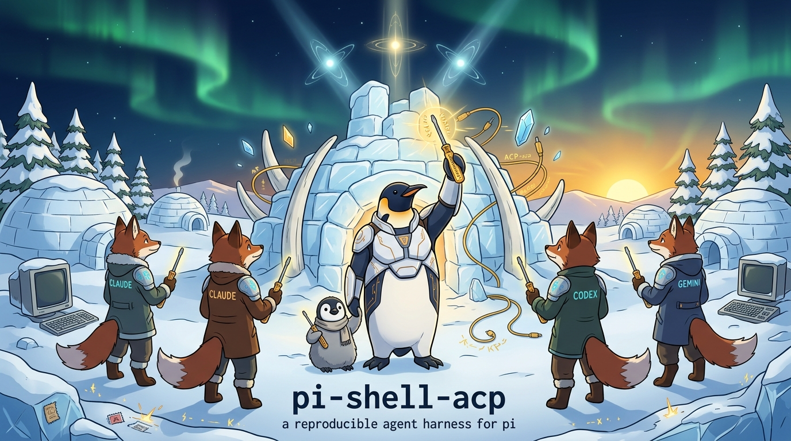

# entwurf

`entwurf` is a garden-citizen dispatch substrate: a thin bridge that lets independent
agent harnesses address one another by **garden id**, without owning each other's
transcript, authentication, tools, or runtime.



[](https://www.npmjs.com/package/@junghanacs/entwurf) · maintained by [junghanacs.com](https://junghanacs.com/)

A sibling is a visible session with its own runtime boundary, not a disposable
worker or a subagent of a new central harness. Entwurf supplies identity, delivery,
receipts and named lifecycle verbs; the operator and native harnesses keep steering.
Git branches, worktrees, file isolation and internal delegation remain their concern.
[Short answers: FAQ](./FAQ.md).

```text
pi / pi-durable / Claude Code / Copilot / OMP / Antigravity / Codex
  → record-backed garden id
    → entwurf_v2
      → control-socket | self-fetch mailbox | native-push
```

The package holds the v2 core, native-harness bridges, a pi adapter and an ACP
plugin. ACP is one ingress, not the boundary; pi is one adapter, not the center.
Claude and Cortex Code are ACP backends. Codex and Antigravity stay native so they
retain their own tools and work context. Capabilities differ by rail: a shipped
citizen is not a promise of every lifecycle operation.

**Native durable contact (`pi-durable`) ships in the [0.31.0 release](https://github.com/junghan0611/entwurf/releases/tag/v0.31.0) (#129).**
It is a separate native harness contact, not ordinary Pi's control-socket adapter.
The contact attaches one durable host to a garden id, adds visible identity and
two-way mailbox contact, while the upstream harness keeps its TUI, models/auth,
SQLite storage and recovery. Native admission passed on one Linux host on the
0.31.0 source-runtime route. Under the #130/0.32 contract the app ships inside the
Entwurf package as a pinned [carrier](#native-durable-pi-durable--130--032-contract), so
it no longer depends on installing the ordinary Pi CLI or provisioning a runtime.

> **Source candidate, not a release.** This branch describes unshipped #130/0.32 work. The
> package stays 0.31.0 until a separately authorized release prepare, and the published 0.31.0
> on npm follows its own source-runtime docs — it does not supply the carrier described in the
> 0.32 contract below.

## Install

**Choose by where you work. Neither route installs a harness, subscription or login.**

### Direct — ordinary shell or tmux

Prerequisites: **Node >=24.0.0**, Python 3 for `setup`, and any harnesses you choose
to use, already installed and authenticated. Pi is optional-by-presence, supported
range `>=1.0.4 <1.1`; Claude Code supported floor `>=2.1.217` is required for its
managed exec-hook lifecycle. pnpm is needed only for source-checkout setup.

```bash
npm install -g @junghanacs/entwurf
entwurf setup /path/to/your-project
entwurf check-bridge
```

`setup` composes each harness it finds and reports PASS / SKIP / FAIL. An absent
harness is an explicit SKIP; a detected incomplete/below-floor integration is a
named FAIL with nonzero exit, not a false green. `check-bridge` proves the installed
MCP bytes boot and list tools without backend auth; it does **not** certify a real
model turn or native receive rail.

[Clean-host setup](./docs/setup-clean-host.md) owns project-local/source installs,
config paths, optional backends, doctors, upgrade/repair and uninstall.
Codex also needs your own hook-trust decision, app-server and exact-directory
consent: [the operator steps](./docs/setup-clean-host.md#three-operator-decisions-before-fresh).
Plain MCP registration alone does not make a garden citizen.

**Platform bounds:** Linux is the certified harness-rail axis. macOS Entwurf-only
installation is **CERTIFIED (CI)**, weaker than a physical-host doctor; its native
harness rails, ACP and mux remain **NOT CERTIFIED — pending physical host**.
Detected harness wiring on Darwin can therefore be written while setup stays
non-green. Native Windows is **UNSUPPORTED**. The package has no npm `os`
restriction; that is not certification of every platform's harness rails.

### Native durable (pi-durable) — #130 / 0.32 contract

**Installing Entwurf from npm supplies pi-durable. There is no runtime checkout, patch,
build or model-data copy for the operator.**

| Component | How it is supplied | What it does not supply |
|---|---|---|
| Entwurf | Existing npm or source-checkout route above | A harness binary, subscription or login |
| pi SDK set (`@earendil-works/*` 1.0.4, incl. the `pi-durable` library) | Exact production dependencies of Entwurf | The experimental app, which upstream does not publish |
| Native experimental durable app/TUI | Entwurf's **carrier**: the pinned upstream v1.0.4 app files, type-stripped, with the narrow runtime-contact overlay (`pi/pi-durable/carrier/`, MIT) | A replacement ordinary Pi CLI or an Entwurf-owned harness |

`entwurf pi-durable` verifies the carrier and the pi SDK set it resolves — every reachable
package edge binds the declared name at exactly the pinned version — and refuses by name otherwise
(`pi-durable-package-incomplete`, `-carrier-drift`, `-sdk-absent`, `-sdk-mismatch`);
`entwurf setup` reports the same verdict as PASS or FAIL (never SKIP) without writing durable
wiring. The ordinary Pi on PATH is a separate subject with its own range above. Native auth,
models, sessions and recovery stay upstream-owned: Entwurf does not copy credentials or convert
ordinary Pi sessions into durable SQLite sessions. One operator module of your own can ride the
launch with `--native-module <absolute file>`: it initializes before the durable runtime and its
default export, a native durable `Extension`, is installed after Entwurf's contact ([setup
§2b](./docs/setup-clean-host.md#2b-optional-native-durable-pi-durable)). Ordinary Pi may warn
that Entwurf's `@earendil-works/*` belong in `peerDependencies`; the exact set is a production
dependency on purpose, for the native process — a known manifest constraint accepted for 0.32.

The installed carrier's runtime/TUI load, its physical SDK edges and the public launch up to the
app's own model resolution are package-gate evidence; the checkout contact/send/receive gates run the
same carrier with scripted S plus native H; Pi ↔ pi-durable LIVE on this supply surface is a separate
release proof. 0.31.0 shipped the earlier source-runtime
route (Pi 1.0.2/source `cd32f77`), which this contract replaces.
See [setup: native durable](./docs/setup-clean-host.md#2b-optional-native-durable-pi-durable)
and [#130](https://github.com/junghan0611/entwurf/issues/130).

### Herdr workbench

```bash
herdr plugin install junghan0611/entwurf/plugins/herdr --yes
```

This is a separate consumer path: it activates only Herdr-integrated **pi and
Claude Code**, acquires the locked Entwurf runtime, and adds an observation pane.
It puts no Entwurf bins on PATH. The
[Herdr integration guide](https://github.com/junghan0611/entwurf/blob/main/plugins/herdr/README.md)
owns its prerequisites, first install → first use, evidence and explicit removal.
The plugin does not own delivery or the Herdr launch rail; a direct-installed
citizen inside Herdr selects that rail from its own process context too.

### Garden launcher

After direct setup, start a pi citizen in your project:

```bash
cd /path/to/your-project
entwurf pi
# equivalent when the package is registered (also the Herdr plugin's spelling):
pi --entwurf-control
```

`entwurf pi` execs your own pi with the control flag. A plain pi may load the
package without becoming a citizen. The record mints the garden id; do not inject
a session id. Native harness launch and manual Herdr argv instructions live in
[setup §2–§5](./docs/setup-clean-host.md#2-optional-pi-adapter--acp-plugin).

In that **harness session**, ask the agent to:

1. Call `entwurf_self` to confirm its authoritative identity.
2. Call `entwurf_peers` to discover existing citizens and their liveness facts.
3. Pick a live garden id and call `entwurf_v2` with a message, for example:

```json
{
  "target": "<garden-id from entwurf_peers>",
  "intent": "fire-and-forget",
  "message": "Hello from a sibling.",
  "wants_reply": true
}
```

These are tools, not shell subcommands. Pi calls
`mcp__entwurf_bridge__<verb>` through Pi's built-in MCP. The server exposes **eight**
verbs; a pi citizen has **six active + two hidden** (`entwurf_inbox_read` and
`entwurf_register_native`), since it has no mailbox and its own extension births it.
The server key stays `entwurf-bridge`. An operator/trusted-project MCP entry with
that normalized namespace can replace the registration by Pi's own precedence;
`/mcp` shows it, and Entwurf does not scan or fight that choice.

## Entwurf orchestration

One narrow dispatch capability connects independent siblings, not an agent factory.
The record is the **sole address authority**. A pane, socket, native transcript id,
model or process marker is a carrier or observation, never a second address axis.
Liveness is read at dispatch time; an id's shape does not tell you its transport.

### `entwurf_v2` — canonical dispatch verb

| What you want | Tool | What its receipt means |
|---|---|---|
| Message, reply or hand off to an existing garden id | `entwurf_v2 {target, intent:"fire-and-forget", message}` | Receiver acceptance boundary, mailbox enqueue or native injection; not completion |
| Open a new visible sibling | `entwurf_fresh_call {backend, model, task, cwd?}` | Launch receipt only; the sibling's nonce callback envelope supplies its new garden id |
| Reopen a dormant pi citizen under its own id | `entwurf_resume_call {target}` | Separate LAUNCH and socket OBSERVATION receipts; no turn is run |

**Delivery starts no process.** A live pi receives over its record-addressed Unix
control socket; an armed self-fetch citizen (Claude Code, Copilot, OMP, pi-durable)
through its mailbox; a probe-alive native-push citizen (Antigravity, Codex) through
its native conversation/thread. Dormant pi, undeliverable mailboxes, dead/indeterminate native
push and record-less sockets reject honestly. Only control-socket dispatch takes
the per-target lock; the other rails use their own deliverability/probe evidence.

A control-socket `sent` means a turn was triggered, not that the model read the
text. `queued-steer` and `queued-follow-up` are volatile process queues, with no
FIFO between them; abort drops them. `accepted-unknown-boundary` is acceptance
we cannot classify, never a reason to retry. A mailbox enqueue is a durable file
receipt. `wants_reply` is etiquette, not waiting, polling or ownership; replyability
is a live rail fact, not merely a consequence of trusted identity.
[DELIVERY](./DELIVERY.md#control-socket-acceptance-boundaries-120) owns these distinctions.

**Mux launches; it never delivers.** Inside Herdr, fresh opens a new unfocused tab
in the caller's workspace, pi/Claude Code only, with no tmux fallback. Outside,
it opens pi/pi-durable/Claude Code/Copilot/OMP/Codex visibly on the caller's own tmux
server. pi-durable runs the installed carrier on its exact SDK set described above and
refuses by name before any window when that verdict is not green; Herdr does not fresh-open it. The model is required; optional `cwd` is a literal
absolute directory, omitted or empty means the caller's cwd. Optional `placement.tmuxSession` names an existing
tmux session (not permitted inside Herdr), never a new session or a cwd lookup.
Omitted tmux placement follows the caller: Codex beside its own TUI pane matched
by thread-id, everyone else in their own session. Missing/ambiguous context refuses.
A launch receipt is neither the callback address nor proof of task processing.
Resume is pi-only, tmux-only, same id, record-supplied transcript/model/provider/cwd;
a live or non-pi target refuses, and an unobserved window stays visible without retry.
Exact boundaries: [tmux launch](https://github.com/junghan0611/entwurf/blob/main/docs/mux-launch-rail.md)
and [Herdr launch](https://github.com/junghan0611/entwurf/blob/main/docs/herdr-launch-rail.md).

## Concept primer

- **Entwurf** (기투, projection-of-self): opening and addressing independent visible
  siblings, not turning them into workers of a second orchestrator.
- **Garden / garden id:** the shared address space and stable id of one V3
  record-backed citizen. Native harnesses keep their own identity and transcript.
- **ACP:** a plugin that exposes backend turns as pi provider/models under the
  operator's own auth. The host pi is already a citizen; ACP mints no second one.
- **MCP:** tool-call ingress to the same compiled `entwurf-bridge`, not a general
  MCP platform or the pi receive rail. ACP uses explicit `mcpServers` declarations;
  no ambient config scan or automatic retrieval. Plain anonymous hosts have no
  authoritative reply address and sends are refused by default.
- **Engraving:** optional short operator text in the backend's identity carrier,
  not rich project context or a hidden tool catalog.

## Pi 1.0 and a short history

**We welcome Pi's built-in MCP:** [You Said No MCP!](https://earendil.com/posts/you-said-no-mcp/)
(Earendil, 2026-09-29). The 0.30.0 cut targets Pi 1.0 admission and ACP basics.
Instead of keeping native pi copies of the verbs, the adapter registers the same
compiled bridge after record birth, under the citizen's identity, and Pi supervises
that MCP child. **MCP is ingress; pi receive remains the record-addressed Unix
control socket.** Garden identity and dispatch stay Entwurf's. That 0.30.0 cut
did not adopt or certify `pi-durable` or codemode. Native durable support is now
released as a separate 0.31.0 native contact, as described above; codemode remains a
harness-internal capability, not another garden citizen. The 0.30.0 follow-up
separately measured Herdr supply 0.9.3 and
re-pinned the plugin runtime to published npm 0.30.0 with manifest 0.30.0; its
public consumer and CI receipts live in the #126 thread. That dated alignment is
not a permanent version-equality rule. 0.30.1 is published (npm, 2026-10-04); at its tag the
plugin's runtime lock is still the closed `herdr-checkout` verification carrier. Publication did
not re-pin it: the measured npm re-pin and its source-specific proof are separate, still-open
work that the [plugin source contract](./plugins/herdr/README.md) owns.

Entwurf is the 0.12+ successor to
[`@junghanacs/pi-shell-acp`](https://www.npmjs.com/package/@junghanacs/pi-shell-acp):
the work was renamed around the dispatch substrate rather than the pi adapter.
The pre-0.12 [two-pane demo](./demo/README.md) is **archived evidence**, including
retired resume behaviour, not current instructions. [CHANGELOG](./CHANGELOG.md)
keeps the release history; dated Codex topology and qualification receipts remain
in [DELIVERY](./DELIVERY.md) and [BASELINE](./BASELINE.md), not rewritten as today's acceptance.

## Detailed operation

### Settings

[Setup — settings and backend-specific keys](./docs/setup-clean-host.md#settings-reference-and-backend-specific-keys)
owns configuration, including billing-safe carrier choices and pi-versus-backend keys.

### External MCP registration

[Setup — external hosts](./docs/setup-clean-host.md#stable-bins-and-external-mcp-hosts)
and [manual wiring](./docs/external-mcp-host.md) own paths, env and identity prerequisites.

### Custom skills

[Setup — custom skills](./docs/setup-clean-host.md#custom-skills) owns the Claude ACP
plugin layout and validation; other harnesses keep their native skill mechanisms.

### Context carriers

[Setup — carriers](./docs/setup-clean-host.md#context-carriers) separates short
engraving from the rich first-user augment and the actual callable schema.

### Compaction policy

[Setup — reuse and compaction](./docs/setup-clean-host.md#session-reuse-and-compaction):
Entwurf does not implement backend compaction or hydrate another harness's transcript.

## What this repo owns, and does not

Owns: garden identity, live-fact dispatch and receipts, native bridge integrations,
visible lifecycle launch seams, the pi adapter and isolated ACP plugin lifecycle.
Does not: a second harness, memory DB, prompt reconstruction, transcript hydration,
credential mediation, subscription bypass, pane-typing delivery or hidden orchestration.
[AGENTS](./AGENTS.md) owns these invariants and exact capability boundaries.

## Verification surfaces

- [VERIFY](./VERIFY.md): evidence strength, deterministic/package gates and LIVE release protocol.
- [BASELINE](./BASELINE.md): operator-driven observations and dated host receipts.
- [DELIVERY](./DELIVERY.md): per-harness async receive capabilities, boundaries and limits.

Installation, a doctor, a fixture and an exact release candidate prove different things;
none is interchangeable with the others or an all-host/long-haul guarantee.

## References

- [FAQ](./FAQ.md) · [Clean-host setup](./docs/setup-clean-host.md) · [Release record](./CHANGELOG.md)
- [Current ordering](https://github.com/junghan0611/entwurf/blob/main/NEXT.md)
- [Adding a harness](https://github.com/junghan0611/entwurf/blob/main/docs/adding-a-harness.md)
- [ACP backend contract](./docs/acp-backend-rail.md)
- [xenodium/agent-shell](https://github.com/xenodium/agent-shell) — Emacs ACP client, `resume > load > new` origin
- [claude-agent-acp](https://github.com/agentclientprotocol/claude-agent-acp) — canonical Claude ACP server
- [agent-config](https://github.com/junghan0611/agent-config) — real consumer

## License

MIT
