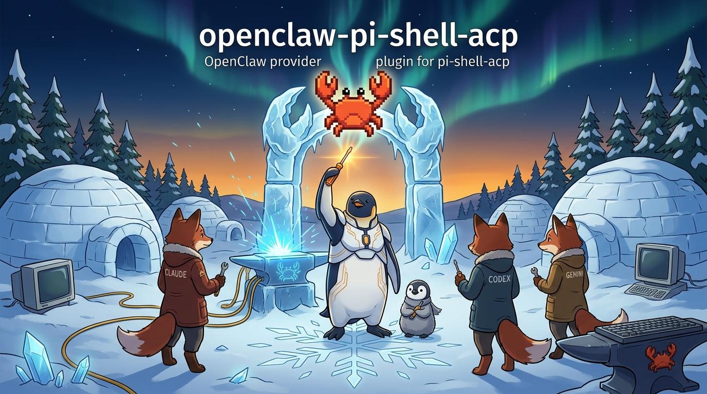

# openclaw-pi-shell-acp

OpenClaw plugin that adds a `pi-shell-acp` provider — an ACP bridge
to Claude Code, Codex, and Gemini CLI backends, using your own
locally authenticated credentials.



> **Status: prerelease.** Manual install only. Not published to npm
> or ClawHub yet. Treat this as a development artifact, not a
> released package.

## What it does

Adds a single new provider, `pi-shell-acp`, to your OpenClaw setup.
Models appear in the picker as:

- `pi-shell-acp/claude-sonnet-4-6`
- `pi-shell-acp/claude-opus-4-7`
- `pi-shell-acp/gpt-5.4`
- `pi-shell-acp/gpt-5.5`
- `pi-shell-acp/gemini-3.1-pro-preview`

Each model routes through the ACP backend of your choice (Claude,
Codex, or Gemini) using credentials you have already set up locally
for those tools.

The curated list mirrors pi-shell-acp's own `SUPPORTED_*_MODEL_IDS`
in the bridge runtime. Other model IDs in the same families may
work through the plugin's generic fallback path but are not part of
this prerelease's tested surface.

## What it is not

- Not a credential reseller. Uses your own existing local auth.
- Not a Claude Code / Codex / Gemini emulator. Each backend keeps
  its own model, API, and tool semantics.
- Not an acpx fork. It is an alternative install path for users who
  want OpenClaw to talk to ACP backends through a different bridge.
- Not a subscription multiplexer. No shared auth, no proxy.

## Requirements

- OpenClaw `>=2026.5.12 <2026.6.0`.
- Locally authenticated Claude Code / Codex / Gemini CLI (one or
  more), each through their own normal auth flow — **inside whatever
  runtime OpenClaw is actually running in** (host, Docker container,
  remote machine). See [Docker boundary](#docker-boundary) below.
- `pi` binary on `PATH` (this plugin spawns a child `pi` process per
  turn to handle ACP framing).

## Docker boundary

If your OpenClaw runs inside Docker, the backend CLI (Claude Code /
Codex / Gemini) must be authenticated *inside the container that
runs OpenClaw*, because that is where this plugin spawns `pi` and
where `pi` reads `~/.claude`, `~/.codex`, `~/.gemini`.

There are two supported ways to satisfy this. The plugin does the
same thing in both cases; the difference is operator policy. The
same choice applies independently per backend (you can do
in-container login for one and host passthrough for another).

| Option | Who is it for | How |
|---|---|---|
| **B. Login inside the container** (public default, recommended) | General users, public deployments | Compose mounts named volumes for `/home/node/.claude`, `/home/node/.codex`, `/home/node/.gemini`. Operator runs `docker compose exec openclaw-gateway claude login` (and the `codex login` / Gemini auth equivalents) once. Auth stays inside the container's volume; the host never exposes its credentials. |
| **A. Pass host backend auth through to the container** (advanced, opt-in) | Trusted single-user deployments (the maintainer's own server, for example) | Compose bind-mounts host paths read/write: `-v ~/.claude:/home/node/.claude`, `-v ~/.codex:/home/node/.codex`, `-v ~/.gemini:/home/node/.gemini`. The container can now use the host's logged-in CLIs. Treat this as making the container part of your trust boundary. |

This plugin does **not** copy, proxy, decrypt, or otherwise mediate
any backend credential. It only spawns a child `pi` process and lets
that process read whatever the official CLI would read. The choice
above is about which filesystem the official CLI is reading from,
not about pi-shell-acp's behavior.

Also required inside the container, but independent of the auth
choice above: the `pi` binary itself, the `pi-shell-acp` package
installed against that `pi`, and the backend ACP executables —
`codex-acp` and `gemini` on `PATH`. The OpenClaw image is
responsible for layering these in; this plugin assumes they are
present at runtime.

### Pi agent overlay (`~/.pi`)

There is one more Docker concern, separate from backend auth. The
child `pi` process writes runtime state into `~/.pi/agent/`
(backend config overlays, session JSONLs, cached resolver state).
Two operator policies cover it:

| Option | What | When |
|---|---|---|
| **Persist runtime state (recommended)** | Mount a named volume at `/home/node/.pi`, so the overlay survives container restarts. | All non-throwaway deployments. The child `pi` regenerates an overlay on first use either way; the volume just keeps it across restarts. |
| **Host `~/.pi/agent` passthrough** (advanced opt-in) | Bind-mount the host `~/.pi/agent` read-only into the container. | Trusted single-user deployments where the operator also runs `pi` on the host and wants the container to see the same skill catalog, entwurf registry, and journal index. Same trust boundary as host backend-auth passthrough. |

The plugin does not write to `~/.pi` itself. It only spawns `pi`,
and `pi` (via pi-shell-acp running inside it) is what touches the
overlay. If you skip both options, the child `pi` will still
function, but each container restart starts from a blank overlay.

### Child skill PATH and emacs socket

The child `pi` process inherits whatever environment OpenClaw
exposes to it. Two host-side env elements affect whether the
documented skill surface is usable from inside the container:

1. **`PATH`** — host pi-skills ship co-located CLI binaries at
   `<pi-overlay>/claude-plugin/skills/<name>/<name>` (e.g.
   `gitcli`, `denotecli`, `lifetract`, `gog`). Skill docs use
   bare-command invocation (e.g. `gitcli day ...` from
   `day-query`'s `SKILL.md`), which requires these directories to
   be on the child's `PATH`. The container's default `PATH` does
   not include them.

2. **`PI_EMACS_AGENT_SOCKET`** — the `emacs` skill connects via
   `emacsclient -s "$PI_EMACS_AGENT_SOCKET"`. In a Docker
   container the emacs socket bind-mount typically lands at
   `/run/emacs/server`; the short-name form (`server`) does **not**
   resolve, because emacs's short-name resolver looks at
   `$XDG_RUNTIME_DIR/emacs/` instead. Set the full socket path,
   not the short name.

Recommended compose `environment:` for ACP-route bots that use
these skills (adjust `<home>` to the OpenClaw user's home inside
the container — `/home/node` for stock OpenClaw images,
`/home/junghan` for the maintainer's deployment):

```yaml
environment:
  - PATH=<home>/.pi/agent/claude-plugin/skills/bibcli:<home>/.pi/agent/claude-plugin/skills/denotecli:<home>/.pi/agent/claude-plugin/skills/dictcli:<home>/.pi/agent/claude-plugin/skills/gitcli:<home>/.pi/agent/claude-plugin/skills/gogcli:<home>/.pi/agent/claude-plugin/skills/lifetract:<home>/.pi/agent/claude-plugin/skills/semantic-memory:/usr/local/sbin:/usr/local/bin:/usr/sbin:/usr/bin:/sbin:/bin
  - PI_EMACS_AGENT_SOCKET=/run/emacs/server
```

On NixOS hosts that bind-mount the Nix store into the container,
also prepend the live emacs path (e.g.
`/nix/store/<hash>-emacs-nox-30.2/bin`) — the hash rotates on
each `nixos-rebuild`, so this entry needs synchronized refresh
with the `volumes:` mount.

Worked example:
[`junghan0611/nixos-config@3477206`](https://github.com/junghan0611/nixos-config/commit/3477206)
(Oracle bbot deployment).

> **Followup.** The plugin itself should prepare this env on the
> ACP code path (skill PATH augmentation + emacs socket
> detection) so operators don't carry this contract by hand.
> Tracked at
> [#21](https://github.com/junghan0611/pi-shell-acp/issues/21).
> Until that ships, the operator-side compose env above is the
> documented workaround.

Native (non-Docker) installs do not need any of this — the
official CLIs are already authenticated, `~/.pi` is already
populated, the host's `PATH` already includes the skill bin
dirs, and the emacs socket is on its conventional path on the
host where OpenClaw runs.

## A note on the two npm scopes in this monorepo

This plugin (`@junghan0611/openclaw-pi-shell-acp`) and the root
bridge (`@junghanacs/pi-shell-acp`) intentionally live under
**different npm scopes**. Both are published by the same npm
account (`junghanacs`); the `@junghan0611` scope is a free public
npm org under that account. The split exists because the plugin
also needs to register on **ClawHub**, where the publisher handle
`@junghanacs` is currently bound to an unresolved RFC and the
publisher handle must match the package scope; the root bridge
has no equivalent constraint (pi has its own provider ecosystem).
Routine maintenance follows one account, two scopes.

## Install (manual, prerelease)

This plugin is currently distributed only as source from this
repository. Public install (`openclaw plugins install <pkg>`) will
come later; for now:

```bash
# 1. Clone the parent repo somewhere local.
git clone https://github.com/junghan0611/pi-shell-acp.git
cd pi-shell-acp/plugins/openclaw

# 2. Manual install into OpenClaw's extensions directory.
node /path/to/openclaw.mjs plugins install "$(pwd)" \
  --dangerously-force-unsafe-install
```

The `--dangerously-force-unsafe-install` flag is required during
prerelease because OpenClaw's `install-security-scan.runtime.ts`
rejects extensions that use `child_process` unless they come from a
trusted source (ClawHub registration or marketplace). Once this
plugin lands on ClawHub, the flag goes away. **Do not use this
flag for arbitrary third-party plugins.**

After install:

```bash
node /path/to/openclaw.mjs plugins list --json
# Look for "pi-shell-acp" with status "loaded".

node /path/to/openclaw.mjs models list --provider pi-shell-acp --json
# Should show the five models above.
```

Recommended `openclaw.json` hygiene:

```json
{
  "plugins": {
    "allow": ["pi-shell-acp"]
  }
}
```

Without an explicit `plugins.allow`, OpenClaw will print a startup
warning about non-bundled plugins auto-loading.

## Configuration

The plugin exposes five configuration keys (see
`openclaw.plugin.json` for full schema). Two are wired in this
prerelease; the rest are reserved for the next development phase.

| Key | Default | Status | Effect |
|---|---|---|---|
| `piBinaryPath` | first `pi` on `PATH` | **wired** | Override path to the `pi` binary. |
| `spawnTimeoutSeconds` | `60` | **wired** (turn-level cap in this stub) | Max wait for the child `pi` process before SIGTERM. Real plugin will scope this to ACP bootstrap only. |
| `mcpInjection` | `"self"` | reserved | Who owns MCP server registration in the child `pi` session. `self` lets the child attach its own `pi-tools-bridge`. The current stub always behaves as `self` regardless of this setting. |
| `lockConflictPolicy` | `"strict"` | reserved | What happens when `entwurf_resume` receives a model that differs from the anchored model. The current stub does not yet enforce either policy. |
| `entwurfTargetsPath` | `~/.pi/agent/entwurf-targets.json` | reserved | Override the entwurf-targets registry path. The current stub does not yet read this setting. |

Reserved keys are accepted by the schema for forward compatibility
but do not change behavior in the prerelease. They land in Phase 1.4
when the stub is rewritten as a real ACP plugin.

## Limitations (prerelease)

- Manual install only; no `openclaw plugins install <pkg>` yet.
- Requires `--dangerously-force-unsafe-install` until ClawHub
  registration.
- Tool dispatch ergonomics are still evolving — the child `pi`
  binary owns its own tool surface; OpenClaw-side tool routing
  for ACP backends is being tuned.
- Tested under Sonnet against the OpenClaw `2026.5.18` production baseline.
  The compatibility floor remains `>=2026.5.12 <2026.6.0`; other models work but are less exercised.
- Each turn emits a `[pi-shell-acp DIAG] ...` line to the gateway's
  stdout for diagnostic purposes. This is intentional during
  prerelease and goes away with the Phase 1.4 rewrite.

## Boundary statement

This plugin connects OpenClaw to locally authenticated ACP backends
through an explicit bridge. It does not patch OpenClaw core, does
not bypass authentication, does not restore hidden transcripts,
and does not resell access to any frontier model provider. If you
do not have your own working install of Claude Code / Codex /
Gemini CLI, this plugin will not give you one.

## Issues

File issues at <https://github.com/junghan0611/pi-shell-acp/issues>.
Mention `[openclaw plugin]` in the title.

## License

MIT.
